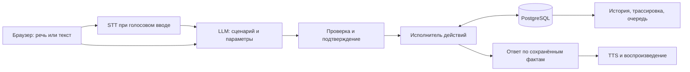

# DIR ECHOES · Voice Router

**От свободной речи к проверяемому действию контакт-центра.** Решение команды DIR ECHOES для кейса Voice Router на HackAlem AI: русский, казахский, турецкий и их сочетания, выбор сценария через LLM, исполнение по правилам и рабочее место супервизора.

[Приложение](https://dir-echoes-voice-router.vercel.app) · [Командный репозиторий](https://github.com/BAITC-Hacks/hack-6d253846-dir-echoes) · [Архитектура](docs/ARCHITECTURE.md) · [План из трёх частей](docs/PLAN.md) · [Эксплуатация](docs/OPERATIONS.md) · [Работа сокомандников](docs/TEAMWORK.md) · [Сдача решения](docs/SUBMISSION.md)

Знаки и исходные файлы фирменного оформления: [материалы бренда](docs/brand/README.md).

> **Текущий production:** `a3313b8196d4f5a47e775077e52dbf4d68113bd9`; push **16:32:40**, локальный SHA совпадает с `origin/main`. Vercel **Ready**, deployment `dpl_AGZwHSGrQsWirGubs3m5cYWPoY7L`. [Основной адрес](https://dir-echoes-voice-router.vercel.app) · [адрес этого деплоя](https://dir-echoes-voice-router-4slrsmsra-shadowocc.vercel.app). Локальные `pnpm build` / TypeScript и Vercel build прошли; health HTTP 200, `ok`, подтверждён в **16:33**. Production после перезагрузки показал новый UI; favicon указывает на `/brand/dir-echoes-mark.png`. При фактическом viewport **600×944** горизонтального переполнения нет. Прежняя собственная история проверена локально; её повторная проверка на этом production reload не заявляется. Живой мобильный голос и системная клавиатура не приняты.

В `a3313b8` опубликованы выбранный знак №4 «птица» в меню/входе/favicon и исправления частиц: до **3400** точек, **1800** на мобильных/ограниченных устройствах, пакетная отрисовка без покадровой сортировки. **60 FPS — цель планировщика, не измеренный FPS.** Реакция на курсор и сохранение короткого измеренного RMS исправлены в коде; 180 фоновых звёзд независимы. Это не подтверждает устранение сообщённого пользователем голосового сбоя: живая приёмка остаётся открытой.

Историческая браузерная проверка `5aac0b5` при **390×844, 390×500 и 844×390** не выявила горизонтального переполнения. Она не переназначается новому деплою и не проверяет физическую клавиатуру ОС или живое аудио.

## Быстрая проверка для жюри

1. Откройте опубликованное приложение по ссылке выше. Выберите «Участник» и введите код доступа из материала сдачи; секреты доступа в репозитории не публикуются.
2. Нажмите «Начать разговор», разрешите микрофон и спросите: «Сколько стоит обязательная страховка на машину?». После паузы приложение распознаёт реплику, выбирает сценарий и озвучивает следующий вопрос. Тот же ввод доступен текстом в панели «Чат».
3. Ответьте на уточнение. Через «Подсказки → Показать логику ответа» проверьте выбранный сценарий, параметры, причину, источник `llm` или быстрый путь и время этапов. Проценты уверенности не являются измеренной точностью.
4. Смените тему, затем попросите вернуться к предыдущему вопросу. Для действия по полису используйте **только записи официального набора**: перед изменением приложение показывает параметры и требует отдельное согласие. Отказ отменяет подготовленную операцию.
5. Через «Меню → История» откройте разговор повторно или перезагрузите страницу: реплики, решения и состояние загружаются из базы. Экспорт JSON доступен в заголовке разговора.
6. Выйдите и войдите с ролью «Супервизор» и отдельным кодом. Проверьте разделы «Супервизор», «Очередь оператора» и «Сценарии»: ручную оценку маршрута, контекст передачи и сохранение новой версии описания каталога.

Для RU/KK обязательны отдельные и смешанные реплики. TR, RU/TR и KK/TR добавлены в контракт, но их качество требует отдельной голосовой проверки. Голос AI, согласованность действий и фактические задержки оцениваются на живом вводе; успешная сборка их не подтверждает.

Локальный запуск: установите зависимости, заполните `.env.local`, укажите путь к официальному набору и выполните `pnpm launch` — подробности ниже. Полная [матрица требований и ограничений](docs/ACCEPTANCE.md) отделяет реализованное от ещё не принятого.
## Что реализовано

- **Разговор:** один старт голосового разговора; локальное определение паузы автоматически отправляет реплику на STT, затем приложение озвучивает ответ и возобновляет прослушивание. Пока AI отвечает, микрофон приостановлен; ответ можно перебить кнопкой. Это поочерёдный разговор, не полнодуплексный Realtime. Текст позволяет продолжить при недоступном микрофоне.
- **Маршрутизация:** 40 сценариев и 3 системных намерения; структурированный ответ LLM содержит язык, сценарии, уверенность, альтернативы и параметры. Для смешанной речи сохраняются конкретные входные языки и языки ответа: RU/KK, RU/TR, KK/TR или все три. Точное «да / иә / evet / нет / жоқ / hayır» к сохранённой операции и проверенное значение одного запрошенного поля продолжают текущий сценарий без нового вызова LLM.
- **Состояние:** сбор данных по одному вопросу, идентификация по записям кейса, несколько намерений, приоритет срочного обращения, смена темы и возврат к сохранённой операции.
- **Исполнение:** 31 обработчик действий, расчёты по правилам набора, проверка принадлежности полиса или заявления, обработка отсутствующих и неподходящих данных.
- **Подтверждение:** любое изменение бизнес-данных или создание запроса доставки сначала показывается клиенту. Выполнение требует согласия на сохранённые параметры; изменение условий требует нового подтверждения. Справочные ответы и экстренные рекомендации доступны сразу.
- **Рабочее место:** мобильная чёрная голосовая сцена, прозрачный раскрываемый чат, до 3400 частиц с облегчённым количеством на мобильных устройствах и реакцией на микрофон и реальный TTS, 180 независимых фоновых звёзд; тёмная тема по умолчанию с сохранением выбора. Подсказки показывают текущую тему и ожидаемое подтверждение; доступны история, экспорт, каталог, трассировка, действия и времена. Супервизор принимает обращение, отвечает и закрывает его; оценивает выбранный сценарий и сохраняет версии описаний и примеров каталога.
- **Хранение:** PostgreSQL сохраняет разговоры, изменения записей, операции, очередь и запросы доставки. Ключи моделей остаются на сервере.

Это исполнитель над данными кейса. Реальные API страховой компании, платёжного сервиса, телефонии, SMS и расписания клиник в материалах отсутствуют. Система различает выполненное изменение своих записей и запрос на внешнее исполнение.

| Действие | Сохраняемый результат |
| --- | --- |
| Изменение контакта, регистрация заявления, жалобы, сообщения о мошенничестве | Изменённая запись или новое зарегистрированное обращение |
| Оформление / продление полиса | `pending_payment`; покрытие и платёжная ссылка не выдумываются |
| SMS / документ по почте | Запись `outbox` со статусом очереди; доставка не подтверждена |
| Запись к врачу / на осмотр, обратный звонок | После согласия — сохранённый запрос и связанное обращение в очереди специалиста; время требует согласования |
| Перевод человеку | Сохранённая очередь и контекст для супервизора внутри приложения |

## Архитектура



| Слой | Текущая реализация |
| --- | --- |
| Приложение | Next.js 16, React 19, TypeScript; App Router и серверные Route Handlers |
| Интерфейс | CSS и Lucide; разговор, история, каталог и очередь оператора |
| Контракты | Zod и Structured Outputs |
| Router / формулировка ответа | OpenAI `gpt-4.1-mini-2025-04-14` |
| Распознавание | OpenAI `gpt-transcribe`, ожидаемые языки RU/KK/TR; модель настраивается |
| Озвучивание | OpenAI `gpt-4o-mini-tts`, голос `coral` |
| Данные | PostgreSQL через `pg`; целевой облачный сервис — Neon |
| Локальная разработка | PGlite с файлами на диске, когда `DATABASE_URL` не задан |
| Публикация | Vercel, Node.js runtime и внешняя PostgreSQL |

Классификатор намерений не используется. Проверочные реплики и ожидаемые метки не входят в runtime-промпт. Дополнительная формулировка ответа опирается на результат исполнителя; при ошибке этого запроса остаётся сохранённый ответ. [Реализованная архитектура](docs/ARCHITECTURE.md) и [фактические таблицы и ограничения](docs/OPERATIONS.md) описаны отдельно.

## Запуск

Нужны Node.js 22+, pnpm, OpenAI API и официальный набор организатора. Для общей облачной версии нужен PostgreSQL; локально допустим PGlite. Команды выполняются из корня репозитория.

```bash
pnpm install --frozen-lockfile
```

Скопируйте `.env.example` в `.env.local` и заполните значения. Секреты не добавляются в Git.

| Переменная | Назначение |
| --- | --- |
| `OPENAI_API_KEY` | Серверный доступ к моделям |
| `DATABASE_URL` | Строка PostgreSQL / Neon с параметрами TLS из кабинета провайдера |
| `SESSION_SECRET` | Случайная строка длиной не менее 32 символов |
| `PARTICIPANT_ACCESS_CODE` | Код участника, не менее 8 символов |
| `SUPERVISOR_ACCESS_CODE` | Отдельный код супервизора, не менее 8 символов |
| `DATASET_PATH` | Внешний каталог, содержащий непосредственно JSON-файлы официального набора |
| `ROUTER_MODEL` | По умолчанию `gpt-4.1-mini-2025-04-14` |
| `STT_MODEL` / `TTS_MODEL` | По умолчанию `gpt-transcribe` / `gpt-4o-mini-tts` |
| `MAX_AI_SPEND_USD` | Суточный лимит оценки расходов приложения; по умолчанию 5 USD |
| `LOCAL_DATABASE_PATH` | Необязательный каталог PGlite для локального запуска; на Vercel требуется PostgreSQL |

`DATASET_PATH` указывает на папку с `scenarios.json`, `slots.json`, `actions.json`, `knowledge_base.json` и `mock_backend.json`. Распакуйте официальный архив **за пределами Git и `public/`**. `__MACOSX` и `.DS_Store` не нужны. Импорт проверяет состав, ссылки каталога и SHA-256; повторный импорт той же версии не перезаписывает изменения клиентов и полисов.

```bash
pnpm launch
```

Одна команда проверяет окружение и доступность порта, импортирует набор из `DATASET_PATH` либо использует уже импортированный каталог, закрывает соединение подготовки, выполняет сборку и запускает приложение. Порт — `PORT` или 13300; занятый порт возвращает ошибку, чужие процессы не завершаются. При отсутствии `DATABASE_URL` используется постоянная локальная PGlite. Для разработки с быстрым обновлением кода остаются отдельные `pnpm db:import` и `pnpm dev`.

Откройте [localhost:13300](http://localhost:13300), выберите роль и введите её код. Участник видит свои разговоры; супервизор видит общую историю и очередь. Вход действует 12 часов. Идентичность участника привязана к cookie браузера: вход с другого браузера не восстанавливает его частную историю автоматически.

Дата страховых расчётов берётся из метаданных набора — **2026-10-01**. Время технических событий сохраняется отдельно.

## Проверка и оценка

```bash
pnpm typecheck
pnpm test
pnpm build
```

Тесты проверяют подтверждение, отсутствие изменений до согласия, повтор операции, владение записями, расчёты, смену темы, язык и состояния очередей. Проверки с официальным набором явно пропускаются без `DATASET_PATH`; это не означает, что они прошли. Микрофон и слышимый ответ проверяются отдельно в браузере.

В локальном браузере подтверждены вход участника и сохранение первого разговора в Neon. Реальный TTS вернул MP3 размером 61 056 байт и сохранил его в кэш; STT распознал эту сгенерированную реплику с HTTP 200 за 2084 мс. Это подтверждение соединения с речевыми API, а не проверка живого микрофона, смешанной речи или качества произношения голосового ответа.

Оценка выполняет реальные платные вызовы router. Число реплик задаётся явно:

```bash
pnpm evaluate --limit 104 --concurrency 2 --max-usd 1 --out reports/routing-check
```

Сохраняются `predictions.json`, `report.json`, `dev_subset.json`. Оригинальный `evaluate.py` принимает predictions и dev_subset для повторного подсчёта метрик. `reports/` исключён из Git: исходные тексты реплик не публикуются вместе с агрегированными результатами.

**Измеренная базовая версия, 23 сентября 2026:** `gpt-4.1-mini-2025-04-14`, все 104 текстовые dev-реплики организатора, новый диалог для каждой реплики; без API-ошибок и пропусков.

| Показатель | Результат |
| --- | ---: |
| Верный основной сценарий | **95,19% — 99 / 104** |
| Полное совпадение набора сценариев | **93,27% — 97 / 104** |
| Основной сценарий: русский | 98,08% — 51 / 52 |
| Основной сценарий: казахский | 91,11% — 41 / 45 |
| Смешанные реплики: основной и полный набор | 7 / 7 |
| Полнота намерений в многотемных репликах | 88,46% — 23 / 26 |
| Медиана полного вызова router | **2308 мс** |
| Оценка стоимости router | **≈ 0,294 USD** |

Это небольшой открытый dev-набор, а не независимая оценка скрытых реплик или всей телефонной работы. Семь смешанных примеров не доказывают надёжность на произвольной речи. Замер не включает STT, действия, TTS и воспроизведение. Формальная цель **500 мс на маршрутизацию не достигнута**; сквозная голосовая задержка и произношение требуют отдельной проверки. Стоимость вычислена по usage и настроенным ставкам, а не по банковскому списанию.

После изменения prompt выбранные 25 граничных примеров дали **25/25** полных совпадений вместо **18/25** в базовой версии. На этой выборке исправлены семь ошибок сценария, но отчёт v4 отдельно содержит две ошибки языка. Полного повторного прогона 104 реплик после последних изменений не было.

Отдельно измерены быстрые продолжения уже выбранного сценария: 12 допустимых и 23 отклоняемых случая на подготовленных состояниях проверки, 1200 локальных повторений; медиана **0,005 мс**, p95 **0,013 мс**, без API. Три парных сравнения с LLM совпали по сценарию, параметрам и подтверждению; их суммарная оценка расходов — **0,0063804 USD**. Это измерение узкого продолжения диалога, не общая точность намерений и не задержка живого голоса. Подробности — в [архитектуре](docs/ARCHITECTURE.md).

## Vercel и Neon

1. Создайте базу Neon и сохраните её строку подключения в серверной переменной `DATABASE_URL`.
2. Выполните `pnpm db:import` локально с этой базой и внешним официальным каталогом. Для опубликованного приложения исходная папка на сервере не нужна: каталог и записи уже находятся в PostgreSQL.
3. Подключите **этот** GitHub-репозиторий к Vercel, выберите Next.js и добавьте `DATABASE_URL`, OpenAI-ключ, секрет сессии, коды ролей, модели и лимит расходов в нужное окружение.
4. Выполните деплой, проверьте `Ready`, вход, сохранение разговора, голос и очередь. Запишите проверенный URL в начало README и форму сдачи.

PGlite не заменяет облачную БД на Vercel: приложение требует `DATABASE_URL`. Обновление кода сохраняет данные во внешней базе. Один успешный `/api/health` подтверждает ответ приложения, но не проверяет БД, LLM и голос.

Текущий подтверждённый production: `a3313b8196d4f5a47e775077e52dbf4d68113bd9`, deployment `dpl_AGZwHSGrQsWirGubs3m5cYWPoY7L` (Ready). Исправления частиц и выбранная птица включены в этот деплой. Приведённые результаты скорости и качества относятся к указанным версиям; цели 500 мс для router и 1,5 с до голосового ответа не объявляются достигнутыми.

## Данные и оставшиеся границы

Набор **Saqta Insurance v1.0** предоставлен организатором. Его README определяет компанию, клиентов и правила как вымышленные материалы кейса; они не являются действующими страховыми или законодательными условиями. Проект использует эти записи без дополнительных вымышленных клиентов и готовых ответов на dev-набор.

В браузерных ответах маскируются распознаваемые телефоны, ИИН и email. Перед LLM-router такие значения заменяются непрозрачными ссылками; сервер восстанавливает их только в извлечённых параметрах перед проверкой правил. Composer получает маскированные факты. Это не универсальное удаление имён и адресов; аудио поступает в STT до обработки текста. Используются только данные кейса, реальные персональные данные вводить или произносить нельзя. Доступ к разговору и роль супервизора проверяются сервером. Общие коды ролей подходят для закрытого мероприятия; полноценные учётные записи, MFA и управление персоналом требуют отдельного внедрения.

Общий журнал в БД резервирует оценку расходов router, подготовки ответа, STT и TTS. Суточный лимит действует по UTC; он не заменяет лимит OpenAI Billing и может отличаться от окончательного счёта. NVIDIA Brev в текущем runtime не используется.

Перед сдачей необходимо закрыть оставшиеся пункты [третьего этапа](docs/PLAN.md), выполнить финальный push и отдельно сохранить решение на платформе организатора через **«Сдать решение»**.
