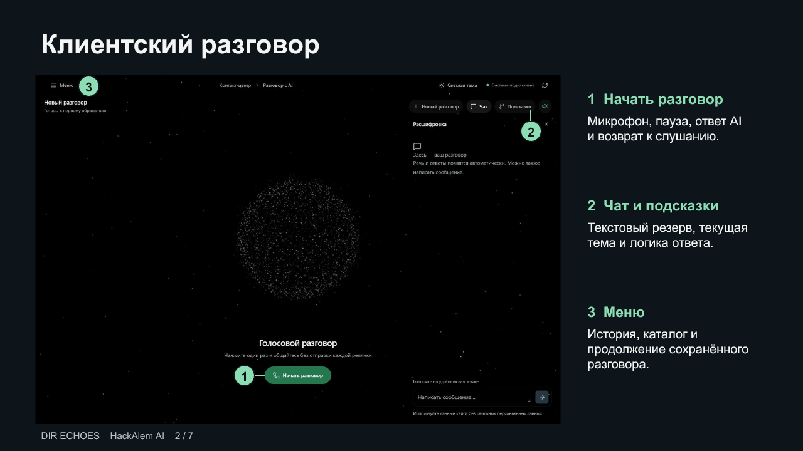
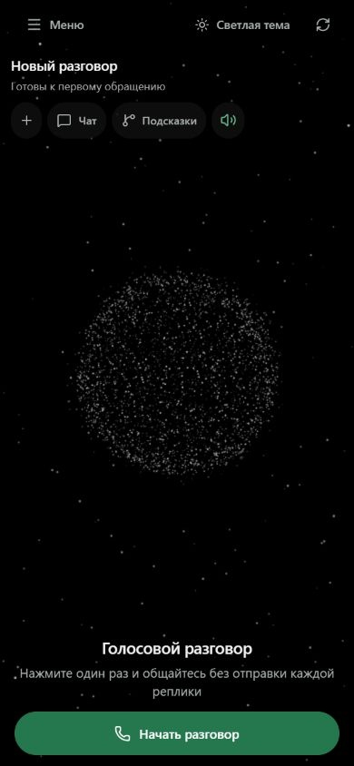
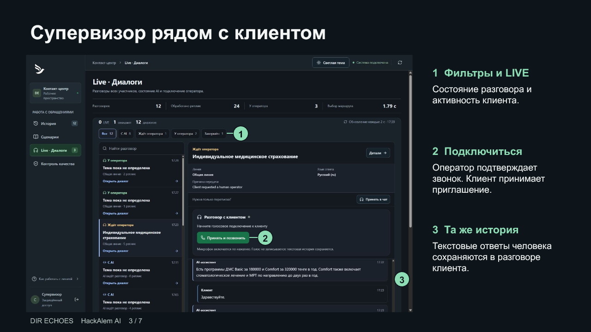
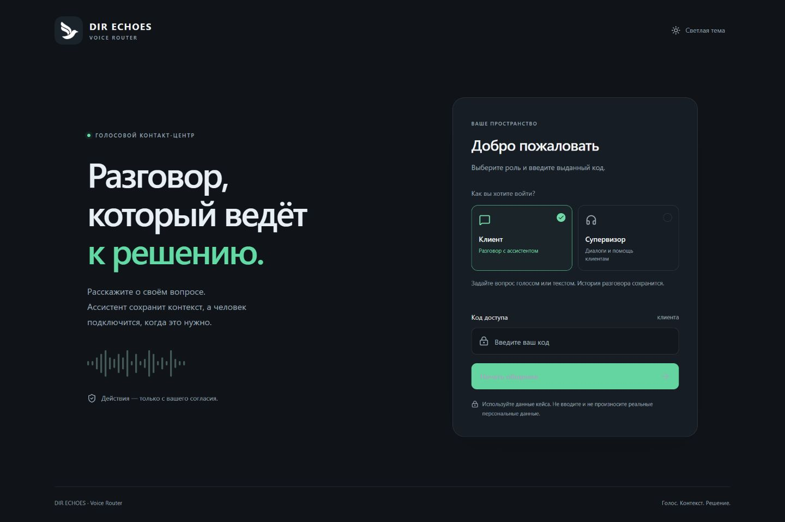
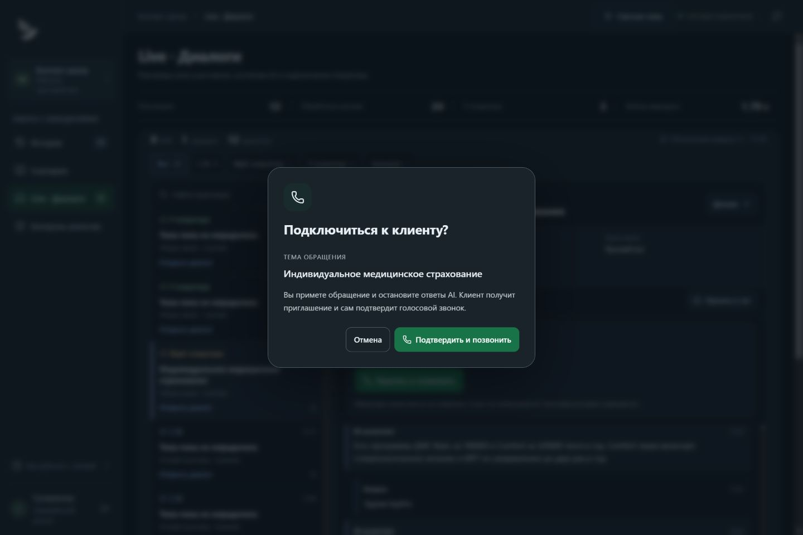
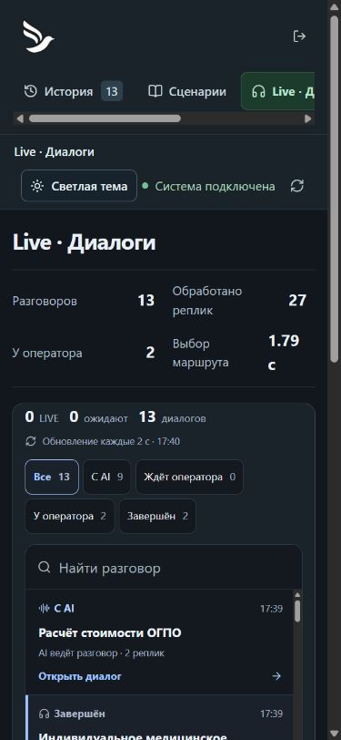
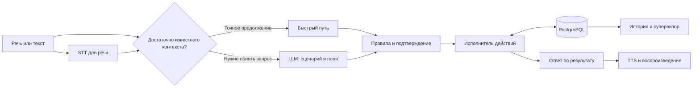

**Деплой: [dir-echoes-voice-router.vercel.app](https://dir-echoes-voice-router.vercel.app)**

Доступ к версии с вымышленными данными кейса. Выберите роль и введите её код; имя пользователя не требуется.

| Роль | Код доступа |
| --- | --- |
| Участник (Клиент) | `F4NgX_D78VKwtMHqp7ZrvQ` |
| Супервизор | `gq7_aO48P3MEqwR8HCv0-JxAtTWxyz4B` |

<p align="center"></p>

<h1 align="center">DIR ECHOES</h1>
<p align="center"><strong>Кейс 2: Voice Router — голосовой робот с AI-слоем выбора сценария</strong><br>DIR ECHOES для HackAlem AI</p>

<p align="center"><a href="https://dir-echoes-voice-router.vercel.app">Открыть приложение</a> · <a href="docs/presentation/DIR-ECHOES.pptx">Презентация PPTX</a> · <a href="docs/presentation/DIR-ECHOES.pdf">PDF</a> · <a href="docs/ARCHITECTURE.md">Архитектура</a> · <a href="docs/ACCEPTANCE.md">Проверка по ТЗ</a></p>

**Задайте страховой вопрос голосом.** DIR ECHOES соберёт недостающие данные, подготовит разрешённое действие к вашему подтверждению или подключит оператора вместе с историей разговора.

**40 сценариев · 43 поля · 31 действие** из официального набора организатора. Эти числа описывают каталог, а не измеренную точность модели.

<p align="center"><a href="docs/assets/client-annotated.png"></a> <a href="docs/assets/mobile-screen.png"></a></p>

Разговор, операции и передача человеку сохраняются в базе. На телефоне главный элемент — голос. Чат, история и объяснение маршрута открываются по кнопке. **Пользователь подтвердил работающую связь с оператором в своём сеансе.** Проверка остальных сетей и устройств остаётся отдельной задачей.

### Механика кейса в продукте

| Требование кейса | Как реализовано |
| --- | --- |
| **Гибридный выбор сценария** | LLM извлекает намерение и поля; серверный исполнитель проверяет правила и действия |
| **Контекст разговора** | Уточнения, смена темы, возврат к сохранённому вопросу и продолжение после перезагрузки |
| **Объяснение решения** | Trace показывает сценарий, причину, альтернативы, параметры, действия и время этапов |
| **Согласие перед действием** | Отдельное подтверждение сохранённых параметров перед изменением или внешним запросом |
| **Живой оператор** | Общая история и подключение человека в том же разговоре, текст и голос WebRTC |

> Опубликованная сборка: **901e228**, Vercel Ready, 23 сентября 2026 в 17:38. [Этот deployment](https://dir-echoes-voice-router-kmhp7nji5-shadowocc.vercel.app). Точные доказательства и ограничения: [контрольные точки](docs/CHECKPOINTS.md).

## Два рабочих места

### Клиент: один разговор, доступные объяснения

| На экране | Что делает |
| --- | --- |
| **Начать разговор** | Запрашивает микрофон. После паузы отправляет реплику, озвучивает ответ и возвращается к слушанию. Завершение останавливает разговор |
| **Чат** | Показывает сохранённые реплики и текстовый ввод; позволяет продолжить без микрофона |
| **Подсказки** | Показывает текущую тему, ожидаемые данные и подтверждение; из панели можно открыть логику ответа |
| **Меню** | Открывает историю и каталог сценариев. Историю можно открыть повторно и продолжить |
| **Новый разговор / тема** | Начинает отдельный разговор / меняет светлое и тёмное оформление |

Частица реагирует на доступный уровень микрофона и декодированную копию TTS. Переходы её формы показывают состояние интерфейса и не служат измерением качества речи.

### Супервизор: разговоры и подключение человека



| Возможность | Результат |
| --- | --- |
| **Список и LIVE** | Общая история, состояния AI/оператора и текущая активность участника. Открытие контекста клиента |
| **Принять и позвонить** | Показывает тему и подтверждение. Оператор принимает обращение, AI прекращает отвечать, клиент отдельно принимает приглашение в голосовой звонок |
| **Ответить / завершить** | Сохраняет ответ в том же разговоре; завершённое обращение блокирует новый ввод |
| **Голос оператора** | WebRTC между участником и оператором, без записи аудио. Без TURN соединение зависит от сети |
| **Качество** | Ручная оценка выбранного сценария, реальные времена этапов и постоянный журнал безопасных кодов ошибок |
| **Сценарии** | Поиск SC01–SC40. Супервизор меняет описания и примеры с сохранением версии; действия и политики защищены от такого редактирования |

Скриншоты сняты с настоящей локальной сборки. Цифровые пометки добавлены поверх неизменённых снимков; они объясняют управление. [Оригиналы и источник снимков](docs/assets/README.md).

<details>
<summary><strong>Ещё реальные экраны: вход, подтверждение звонка и мобильный супервизор</strong></summary>

Вход с выбором роли. Демо-коды находятся в начале README.



Перед подключением оператор видит тему. Клиент получает приглашение и сам принимает голосовой звонок. Кнопка «Отмена» закрывает подтверждение без включения микрофона.



Список разговоров супервизора на узком экране:

<p align="center"></p>

</details>

## Проверка для жюри за пять шагов

1. **Войти участником.** Откройте [приложение](https://dir-echoes-voice-router.vercel.app) и используйте код из таблицы в начале README. Используйте только вымышленные данные официального кейса.
2. **Начать разговор.** Скажите: «Сколько стоит обязательная страховка на машину?» Это стартовый пример SC01. Ответьте на уточнения. При недоступном микрофоне откройте «Чат».
3. **Открыть логику.** Через «Подсказки» проверьте сценарий, собранные поля, причину, действия и время этапов. Затем смените тему и вернитесь к предыдущему вопросу.
4. **Проверить согласие и историю.** Для SC29 попросите сменить почту по записи кейса. Сначала откажитесь от подготовленного изменения, затем повторите и подтвердите. Перезагрузите страницу и откройте сохранённый разговор.
5. **Передать человеку.** Скажите «Соедините с оператором» (SC37). В отдельном браузере войдите супервизором, откройте разговор и нажмите «Принять и позвонить». Подтвердите тему, а на стороне клиента примите звонок. Ответьте и завершите обращение. Голосовое соединение проверяйте с двумя устройствами.

Эти шаги являются маршрутом приёмки. Они не означают, что все устройства, языки и сети уже проверены.

<details>
<summary><strong>Ещё один официальный маршрут и где находятся 40 сценариев</strong></summary>

Откройте **«Меню → Сценарии»**: поиск по коду или названию, параметры, действия, требования идентификации и примеры. Нажатие примера переносит текст в черновик; отправка остаётся отдельным действием.

Для SC18 спросите **«Какие документы нужны для выплаты?»**, затем назовите продукт ОГПО. Ответ должен опираться на kb_lookup. Вопрос о документах сам по себе не регистрирует страховой случай. Запрошенная отправка SMS требует согласия, а очередь доставки не означает фактически отправленное сообщение.

Для SC01 используйте регион Алматы, легковой автомобиль и ИИН водителя из набора. Для SC29 контакт и идентификатор берите только из набора. SC37 также содержит официальный пример «Операторға қосыңызшы».

</details>

## Как устроено



LLM предлагает маршрут. Сервер проверяет обязательные поля, принадлежность записи, допустимость действия и согласие клиента. Повтор запроса использует идентификатор операции и не должен создавать вторую запись. Продолжение известного поля, подтверждение и узкие точные совпадения могут обходить новый вызов LLM.

| Слой | Стек |
| --- | --- |
| Web и API | Next.js 16, React 19, TypeScript, Zod |
| AI | OpenAI gpt-5.4-mini, reasoning_effort: none; модель задаётся сервером |
| Речь | gpt-transcribe, gpt-4o-mini-tts, нативный HTMLAudioElement |
| Данные | PostgreSQL / Neon, локально постоянная PGlite |
| Оператор | Сохранённая очередь и сообщения, WebRTC с временным SDP |
| Публикация | Vercel, серверные ключи и внешняя PostgreSQL |

## Один запуск после настройки

Нужны Node.js 22+, pnpm, доступ к OpenAI и официальный набор организатора.

1. Установите зависимости: `pnpm install --frozen-lockfile`.
2. Скопируйте `.env.example` в `.env.local`. Заполните `OPENAI_API_KEY`, `SESSION_SECRET`, отдельные коды участника и супервизора. Укажите `DATASET_PATH`; для облачной версии также `DATABASE_URL`.
3. Выполните:

```bash
pnpm launch
```

Команда проверяет окружение, импортирует набор, собирает и запускает приложение. По умолчанию адрес [localhost:13300](http://localhost:13300). Занятый порт возвращает ошибку и не останавливает чужие процессы. Без DATABASE_URL локальная версия сохраняет данные в PGlite.

DATASET_PATH должен указывать на внешний каталог с scenarios.json, slots.json, actions.json, knowledge_base.json и mock_backend.json. Исходный архив, клиентские записи, API-ключи и строка подключения базы **не добавляются в Git или public/**. Демо-коды доступа к опубликованному приложению указаны выше по решению владельца проекта. [Полные настройки и эксплуатация](docs/OPERATIONS.md).

## Границы решения

- **Данные и действия.** Работает официальный вымышленный набор. Контакты и обращения сохраняются в базе приложения. Реальных API страховщика, платежей, SMS и расписаний нет: внешние запросы остаются в очереди, полис ожидает оплату, доставка не заявляется выполненной.
- **Подтверждение.** Любое изменение бизнес-данных и запрос внешнего действия требуют отдельного согласия на сохранённые параметры. Явная просьба о переводе оператору разрешает сам перевод.
- **Языки.** Контракт принимает нормализованные коды языков и смешанную речь. Новые языки допускают справочный перевод; изменения данных требуют проверенных серверных формулировок RU/KK/TR. Качество каждого нового языка отдельно не измерено.
- **Голос и скорость.** Поочерёдный разговор с определением паузы, не полнодуплексный Realtime. Цели **500 мс / 1,5 с не подтверждены**. Пользователь сообщил о медленном ответе и проблеме слышимости синтезированного ответа в Codex IAB; публикация исправлений не заменяет проверку живым человеком.
- **Операторский голос.** Пользователь подтвердил работу связи с оператором в своём сеансе. STUN без настроенного TURN обеспечивает соединение не во всех сетях; это подтверждение не распространяется автоматически на другие устройства и сети.
- **Приватность.** Аудио отправляется в STT до текстовой маскировки. Не вводите и не произносите реальные персональные данные. Секреты остаются на сервере, технический журнал содержит безопасный код, этап и внутренние ссылки.

## Материалы проекта

| Материал | Содержание |
| --- | --- |
| [Презентация PPTX](docs/presentation/DIR-ECHOES.pptx) / [PDF](docs/presentation/DIR-ECHOES.pdf) | 7 слайдов, редактируемые подписи и схема |
| [Архитектура](docs/ARCHITECTURE.md) | Контракты, состояние диалога, безопасность исполнения |
| [Приёмка по ТЗ](docs/ACCEPTANCE.md) | Реализованное, доказательства, непроверенное |
| [Контрольные точки](docs/CHECKPOINTS.md) | Точные SHA, deployment и исторические измерения |
| [Эксплуатация](docs/OPERATIONS.md) | Переменные, импорт, запуск, расходы и ограничения |
| [План](docs/PLAN.md) / [сдача](docs/SUBMISSION.md) | Три этапа работы и требования мероприятия |

Историческая текстовая оценка прежней модели хранится отдельно от текущего профиля. HTTP 200, успешная сборка и видимый интерфейс не доказывают живой голос, точность маршрута или достижение целевой задержки.
