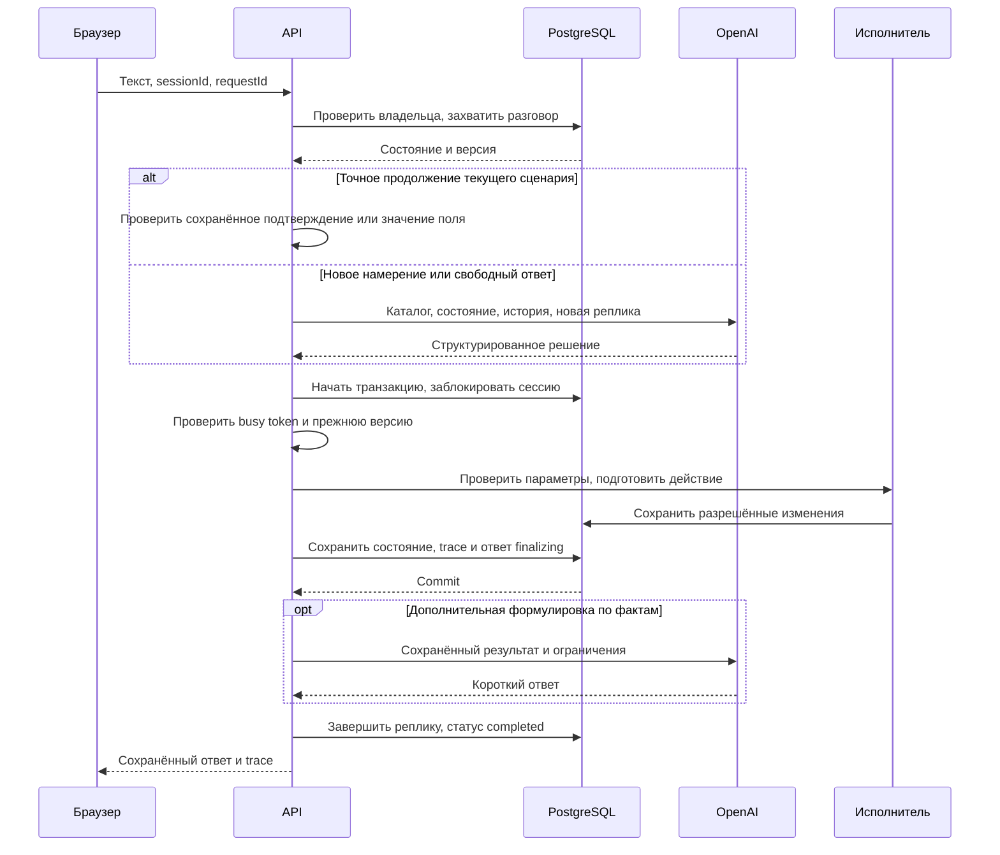

# Архитектура DIR ECHOES · Voice Router

Документ описывает **реализованную архитектуру** по исходному коду. Текущие проверки и оставшиеся задачи — в [PLAN.md](PLAN.md); настройка и запуск — в [OPERATIONS.md](OPERATIONS.md). Внешний production URL и проверка живой речи фиксируются отдельно от наличия реализации.

## Состав приложения

Один Next.js-проект содержит браузерное рабочее пространство и серверные API. Router, исполнитель и доступ к БД — модули одного приложения, а не отдельные микросервисы. Внешние зависимости runtime — OpenAI API и PostgreSQL; для облачной БД используется Neon, целевой хостинг — Vercel. NVIDIA Brev и отдельный интерфейс сменных inference-провайдеров в текущей реализации не используются.

| Компонент | Реализация и исходный код |
| --- | --- |
| Интерфейс разговора и микрофона | React, CSS, Lucide; [voice-workspace.tsx](../src/components/voice-workspace.tsx), [workspace-ui.tsx](../src/components/workspace-ui.tsx), [workspace-panels.tsx](../src/components/workspace-panels.tsx) |
| HTTP API | Next.js App Router, Node.js runtime; [route.ts](../src/app/api/%5B...path%5D/route.ts) |
| Авторизация | Подписанные cookie, роли participant / supervisor, проверка Origin; [auth.ts](../src/lib/auth.ts) |
| Оркестрация реплики | Захват разговора, запрос модели, транзакция действия и восстановление ответа; [conversation.ts](../src/lib/conversation.ts) |
| LLM, STT, TTS | OpenAI SDK, Zod / Structured Outputs, тайм-ауты и отключённые SDK-повторы; [ai.ts](../src/lib/ai.ts) |
| Быстрое продолжение | Точное согласие / отказ и атомарное значение запрошенного поля; [fast-path.ts](../src/lib/fast-path.ts) |
| Политика диалога | Параметры, очереди тем, уточнения, подтверждение; [domain.ts](../src/lib/domain.ts) |
| Исполнитель | 31 разрешённое действие, сначала план изменений, затем запись; [domain-actions.ts](../src/lib/domain-actions.ts) |
| Данные и расчёты | Нормализация, формулы набора, даты и доступные источники знаний; [domain-data.ts](../src/lib/domain-data.ts) |
| Хранение | PostgreSQL / pg, локальная PGlite, транзакции и схема; [db.ts](../src/lib/db.ts), [repository.ts](../src/lib/repository.ts) |
| Импорт | Проверки каталога и SHA-256; [dataset.ts](../src/lib/dataset.ts), [import-dataset.ts](../scripts/import-dataset.ts) |
| Расходы | Общий журнал резервирования оценочной стоимости; [budget.ts](../src/lib/budget.ts) |
| Супервизия | Ручная оценка маршрута, метрики, версии описаний каталога; [supervision.ts](../src/lib/supervision.ts), [supervisor-tools.tsx](../src/components/supervisor-tools.tsx) |
| Общие контракты | Типы состояния, решений, действий и trace; [types.ts](../src/lib/types.ts) |

## Жизненный цикл реплики

Для голоса браузер сначала записывает отдельную реплику и отправляет файл в STT. Полученный текст проходит тот же серверный путь, что и текстовый ввод. Смысловая маршрутизация выполняется LLM по всему каталогу; энкодерный классификатор не применяется.

Последовательность в [processTurn](../src/lib/conversation.ts):

1. Проверить доступ к разговору и ограничение частоты. В транзакции заблокировать строку сессии, проверить повтор `requestId`, статус и действующий захват обработки.
2. Создать реплику `processing`, записать `busy_token` и `busy_until` на 100 секунд. Сохранить текущую версию для последующей проверки.
3. Проверить узкое продолжение текущего сценария. При отсутствии точного совпадения вызвать LLM-router **вне SQL-транзакции**. Модель получает каталог сценариев, состояние и последние сообщения; dev-метки ей не передаются.
4. В новой транзакции заблокировать сессию и сверить токен и версию. Только после этого передать решение исполнителю.
5. Зафиксировать изменения сущностей, результат операции, новое состояние, очередь при необходимости, trace и ответ исполнителя. Реплика получает статус `finalizing`.
6. При необходимости отдельно улучшить формулировку ответа по фактам. Preview, вопрос о недостающем параметре, ошибка и handoff не проходят этот дополнительный этап.
7. Сохранить окончательный ответ как `completed` и освободить захват. Если улучшение формулировки не удалось, используется уже сохранённый ответ исполнителя.

Таким образом, необязательная генерация текста не является условием сохранности выполненного действия.

## Решение LLM и серверная политика

В [ai.ts](../src/lib/ai.ts) проверяются идентификаторы, структура и типы ответа. Router использует `gpt-4.1-mini-2025-04-14`; модель задаётся серверной настройкой. Каталог включает все 40 сценариев с описаниями, границами `not_this_if` и примерами. Проверочные ответы не зашиты в runtime.

Результат содержит список сценариев с уверенностью и кратким обоснованием, альтернативы, параметры, признак продолжения, подтверждение / отказ и вопрос для уточнения. `language` описывает вход (`ru`, `kk`, `mixed`); `responseLanguage` задаёт язык ответа и допускает смешанную речь. `tone` управляет формулировкой, но не разрешениями или правилами действий. Уверенность модели — эвристическая оценка, а не калиброванная вероятность.

Исполнитель применяет пороги кейса: от 0,75 — обработка сценария; неоднозначность между 0,45 и 0,75 — уточнение; после двух низкоуверенных неразрешённых запросов предлагается передача оператору. Клиент подтверждает её до создания обращения. Явная просьба о человеке уже выражает решение клиента и сразу создаёт handoff. Срочные сценарии обрабатываются перед остальными; другие намерения сохраняются.

Язык и границы намерений остаются предметом оценки. Строгая JSON Schema обеспечивает форму ответа, но сама по себе не доказывает правильность сценария или языка.

[Быстрое продолжение](../src/lib/fast-path.ts) не выбирает новое намерение. Оно принимает точное «да / иә / нет / жоқ» только при соответствующей сохранённой операции либо одно атомарное значение ожидаемого поля, проверенное нормализатором каталога. Свободный текст, смена темы и неоднозначные ответы идут в LLM. Булевы ответы на произвольно сформулированные вопросы не перехватываются. Trace различает `llm`, `slot` и `confirmation`; быстрый маршрут имеет нулевую стоимость вызова router.

## Состояние, действия и подтверждение

`DialogueState` хранит активный сценарий, отложенные и прерванные темы, параметры отдельно по сценарию, найденного клиента, ожидаемую операцию, последний вопрос, число неуспешных уточнений и язык ответа. Версия и владелец находятся в строке `sessions`.

[Исполнитель](../src/lib/domain-actions.ts) содержит все **31 действие** из каталога. Он проверяет необходимые параметры самого действия, даже если сценарий отметил часть из них необязательными. Проверяется принадлежность полиса / заявления; для обращения пострадавшего по чужому ОГПО возвращается ограниченный результат проверки полиса виновника. Для отсутствующего тарифа или внешней доступности результат не придумывается.

Статусы результата действия: `read`, `preview`, `executed`, `queued`, `failed`. Отдельного статуса действия `confirmed` в контракте нет: подтверждение выражается сохранённой операцией и переходом к исполнению.

Перед любым изменением бизнес-сущностей, созданием outbox-запроса или автоматической передачей специалисту сохраняются operation ID, параметры и человекочитаемое описание. Preview не записывает бизнес-сущности. Контрольная SHA-256 подпись охватывает все запланированные изменения и передачу; случайные ID и технические временные метки нормализуются, чтобы одинаковые условия не требовали повторного согласия. Исполнение использует сохранённые параметры; их изменение либо изменение условий требует нового подтверждения. Выполненный результат хранится как `entities(kind='operations')`, поэтому повтор того же подтверждения возвращает сохранённый результат.

Справочные чтения по запросу клиента не требуют дополнительного согласия. Рекомендации звонить 112 и не раскрывать коды при подозрении на мошенничество выдаются сразу, до уточнения параметров или подтверждения записи. Отказ от предложенной передачи возвращает сохранённую тему диалога; неясный ответ на предложение передачи оставляет безопасное ожидание согласия.

HTTP-идемпотентность обеспечивается отдельно через уникальную пару `turns(session_id, request_id)`. Повтор завершённого запроса возвращает историю; использование того же ключа с другим текстом или режимом отклоняется.

## Фактическая схема хранения

Схема создаётся в транзакции с advisory lock для последовательной инициализации независимых серверных процессов. См. [db.ts](../src/lib/db.ts) и [budget.ts](../src/lib/budget.ts).

| Таблица | Назначение |
| --- | --- |
| `dataset_versions` | Текущий импортированный набор, каталог, знания, метаданные и хеш |
| `sessions` | Владелец, состояние, версия, захват обработки и время обновления |
| `turns` | Реплика, ответ, trace, mode, request ID и стадия обработки |
| `entities` | Общая таблица kind/id/data для бизнес-сущностей и результатов операций |
| `handoffs` | Очередь, причина, резюме и waiting/active/closed; не более одного открытого обращения на сессию |
| `rate_limits` | Общие ограничения частоты |
| `speech_audio` | Аудио сохранённого ответа, хеш текста и время первого байта |
| `speech_leases` | Временный захват TTS для защиты от одновременного синтеза одной реплики |
| `ai_budget_days`, `ai_budget_ledger` | Оценочная сумма по суткам UTC, резервирование и закрытие API-вызовов |
| `review_annotations` | Ожидаемый основной сценарий и комментарий супервизора к завершённой LLM-реплике |
| `catalog_revisions` | Версии редактируемых описаний и примеров поверх исходного каталога, цепочка хешей и автор |

В `entities` находятся `clients`, `policies`, `claims`, `payments`, `operations`, `outbox`, `complaints`, `callbacks`, `disputes`, `appointments`, `inspections`, `fraud`. Отдельных таблиц `scenario_catalog`, `knowledge` и `action_runs` нет; сведения о действиях хранятся в trace реплик и в результате операции.

Импорт читает официальный каталог из внешнего `DATASET_PATH`, проверяет состав и ссылки, вычисляет SHA-256 и сохраняет данные в PostgreSQL. Повтор той же версии не перезаписывает изменённые записи. Другой хеш требует явной миграции. Runtime на Vercel читает данные из БД, исходная папка на сервере ему не нужна.

Дата бизнес-правил — `scenarios.meta.as_of_date`, сейчас 2026-10-01. Переменная окружения не переопределяет эту дату. Время технических событий сохраняется независимо от неё.

## Очередь супервизора

Handoff сохраняет очередь, причину и резюме вместе с изменением состояния разговора. В состоянии `handoff` новые сообщения клиента сохраняются для оператора без нового вызова router.

После подтверждения запрос приёма создаёт связанное обращение в `medical_assistance_24_7`, осмотра — в `claims_team`, обратного звонка — в `operator_general`. Бизнес-запись хранит очередь и идентификатор разговора, а причина handoff содержит номер запроса. Супервизор согласует исполнение через очередь и историю. Принятие обращения само по себе не подтверждает внешнее расписание или состоявшийся звонок.

При принятии и закрытии создаются отдельные operator-реплики в истории. Текст оператора также сохраняется как реплика. Закрытие переводит и обращение, и разговор в завершённое состояние. Назначение конкретного сотрудника и персональные аккаунты операторов не реализованы: действие доступно авторизованной роли supervisor.

Порядок блокировки при изменении очереди: **сначала строка sessions, затем handoffs**. Обработка клиентской реплики проверяет версию и захват ещё раз внутри транзакции, чтобы не записать ответ поверх закрытого или изменённого обращения. Исходный код — [API очереди](../src/app/api/%5B...path%5D/route.ts), [conversation.ts](../src/lib/conversation.ts).

## Ручная оценка и версии каталога

Супервизор сохраняет ожидаемый основной сценарий и комментарий к завершённой LLM-реплике. Повторная оценка того же автора обновляет его запись; агрегат использует последнюю оценку на реплику. Отдельно показываются доля просмотренных реплик, согласие с оценкой, ошибки действий и p50/p95 router и сервера по источнику. Эти показатели описывают сохранённые разговоры и ручную выборку, а не точность на всём наборе.

Редактор допускает название, описание, RU/KK-примеры и границы `not_this_if` существующих 40 сценариев. Действия, тарифы и исходные записи организатора через него не меняются. Новая версия сохраняется поверх исходного каталога с базовым и родительским хешами; оптимистическая проверка версии предотвращает перезапись чужой правки. Trace следующей маршрутизации содержит фактически использованный хеш. Исходный код — [supervision.ts](../src/lib/supervision.ts).

## Голос и наблюдаемость

Текущий путь — **MediaRecorder → загрузка записи → STT → router → исполнитель → ответ → TTS → воспроизведение**. Это обработка отдельных реплик; непрерывный телефонный разговор, потоковый VAD и barge-in не реализованы.

STT по умолчанию — `gpt-transcribe`, TTS — `gpt-4o-mini-tts`. Есть лимиты размера и длительности записи, серверный доступ к API и явные ошибки. Аудио ответа сохраняется в `speech_audio`; `speech_leases` ограничивает одновременные повторные запросы синтеза. TTS не отменяет сохранённый текст при ошибке.

Серверный TTS передаёт поступающие аудиофрагменты браузеру и сохраняет завершённый результат в кэш. Этот поток относится к озвучиванию готового ответа; он не превращает запись микрофона в непрерывный разговор. Реализация потоковой доставки ожидает проверки фактического начала воспроизведения в браузере после финального деплоя.

Trace хранит сценарии, альтернативы, краткое объяснение, язык входа и ответа, параметры, действия, модель, хеш каталога, usage, предупреждения и времена этапов. Для текстового ввода STT равен `null`. Общая панель считает разговоры / реплики / открытые обращения и медиану router. Супервизия дополнительно вычисляет p50/p95 router и серверной обработки отдельно для LLM, значения поля и подтверждения.

Медиана router, первый байт TTS и начало воспроизведения — разные показатели. Формальная цель 500 мс на router не достигнута. Полная задержка от окончания живой речи до слышимого ответа требует отдельного браузерного замера.

## Поведение при отказах

| Ситуация | Что делает код | Что остаётся проверить / выполнить |
| --- | --- | --- |
| Router вернул ошибку, тайм-аут или невалидный контракт | Исполнитель не запускается; реплика помечается failed, пользователь получает ошибку; скрытых SDK-повторов нет | Повторить запрос после устранения причины; новый вызов может тарифицироваться |
| Ошибка дополнительной формулировки | Остаётся сохранённый ответ исполнителя; в trace добавляется предупреждение | Действие не нужно выполнять заново |
| Процесс остановился после commit действия | Сохранены сущности, состояние, trace и ответ finalizing; после истечения захвата чтение истории восстанавливает completed | До истечения захвата обработка может оставаться занята; срок захвата — 100 секунд |
| Повтор завершённого request ID | Возвращается сохранённый результат; другая реплика с тем же ключом даёт 409 | Клиент должен повторно использовать исходный ID только для того же запроса |
| Одновременные реплики / изменение состояния | Строковая блокировка, busy token и прежняя версия защищают запись; конфликт возвращает 409 | Обновить историю и повторить незавершённый ввод |
| БД недоступна | Сервер не заявляет успешное сохранение, возвращает ошибку; автоматической офлайн-очереди нет | Восстановить соединение и проверить историю перед повтором |
| STT или TTS недоступен | Возвращается ошибка соответствующего API; сохранённый текст остаётся доступным | Продолжить текстом; отдельно проверить модель, доступ и запись |
| AI-лимит исчерпан или исход вызова неизвестен | Новый вызов блокируется; неопределённый резерв не освобождается автоматически | Сопоставить журнал приложения и биллинг провайдера |
| Внешняя доставка / оплата / расписание не подключены | Сохраняется queued / pending_payment / request_pending без ложного завершения | Обработать через супервизора или подключить разрешённый внешний сервис |

Это описание существующих механизмов, а не утверждение о проведённых испытаниях всех отказов на production.

## Доступ и границы внешних систем

Сессия подписывается сервером, роли проверяются на API. HMAC-токены имеют разные назначения: session хранит роль и действует 12 часов; browser_identity хранит только идентификатор браузера на 30 дней и не восстанавливает доступ сам по себе. Участник видит свои разговоры; супервизор — общую историю и очередь. Идентичность участника связана с cookie браузера. Общие коды ролей не заменяют персональные аккаунты и MFA. Поиск клиента по идентификатору из кейса не является проверкой владения телефоном через OTP.

Телефоны, ИИН и email маскируются в выдаваемых браузеру данных. Исходный набор и ключи не помещаются в public или клиентский код. Модель получает необходимые параметры диалога и результаты действий; применение настоящих персональных данных требует отдельного согласованного режима.

Данные организатора представляют вымышленную Saqta Insurance. Исполнитель реально меняет записи этого набора, но не подключён к продуктивной системе страховой компании. Новые полисы имеют `pending_payment`, доставка хранится в outbox, запись к врачу / на осмотр — как запрос без подтверждённого времени. Внешний SMS, телефонный перевод, эквайринг и расписание не считаются выполненными.

## Измеренные результаты и открытые проверки

| Проверка | Подтверждённый результат | Ограничение |
| --- | --- | --- |
| Базовый полный dev-прогон, 104 реплики | Основной сценарий 99/104 (95,19%); полный набор 97/104 (93,27%); mixed 7/7; median router 2308 мс; около 0,294 USD | Только текстовый router, новый диалог на реплику; открытый небольшой набор |
| Выборочная проверка границ v4, 25 реплик | Полное совпадение **25/25**, вместо **18/25** в базовой версии на тех же репликах; исправлены все 7 выбранных ошибок, регрессий на этой выборке нет | Реплики отобраны по ошибкам и соседним случаям; **полного повторного прогона 104 реплик после изменений не было** |
| Язык в выборке v4 | Отчёт зафиксировал **2 ошибки языка**: U012 и U078, ожидается kk, возвращены ru и responseLanguage=ru | Результат 25/25 относится к сценариям; последующие языковые правки не переоценены полным прогоном |
| Локальное приложение и Neon | Вход участника, сохранение разговора и первая реплика по расчёту подтверждены | Проверка опубликованной версии выполняется отдельно |
| Связность речевых API | TTS вернул MP3 61 056 байт; STT распознал сгенерированный ответ с HTTP 200 за 2084 мс | Это не живая запись человека и не тест code-switching |
| Первый деплой Vercel | [Production URL](https://dir-echoes-voice-router.vercel.app): HTTP 200, вход, 40 сценариев и сохранённая история | Последние изменения согласия, супервизии, быстрого продолжения и аудио требуют финального деплоя и браузерной проверки |

Выборочная v4-проверка имела median router **2393 мс** и оценочную стоимость **0,0297556 USD**. Подробные отчёты находятся локально в исключённых из Git каталогах `reports/routing-v1/` и `reports/routing-boundaries-v4/`; тексты исходного набора не публикуются. Скрипт полного evaluator — [evaluate.ts](../scripts/evaluate.ts).

Быстрый маршрут измерялся отдельно на подготовленных состояниях проверки: **12 допустимых и 23 отклоняемых случая**, 1200 локальных повторений, без API; median **0,005 мс**, p95 **0,013 мс**, максимум **1,466 мс**. Три парных сравнения с обычной LLM дали совпадающие сценарий, параметры и подтверждение: число — 0,034 против 5893 мс; дата на казахском — 0,173 против 2709 мс; подтверждение смешанного диалога — 0,043 против 1927 мс. Суммарная оценка этих трёх API-вызовов — **0,0063804 USD**. Отчёты: `reports/fast-path-v1/report.json` и `reports/fast-path-v1-final-local/report.json`. Это измерение узких продолжений, не новый показатель точности намерений, не клиентские продуктовые данные и не сквозная задержка речи.

Приоритет следующей работы — повторно проверить язык после правок, выполнить живую проверку речи, опубликовать последнюю версию и сдать реализованный продукт. Для описанного сквозного сценария новый архитектурный слой не требуется. Изменение визуального оформления отложено решением участника и не блокирует архитектурную приёмку или сдачу.
