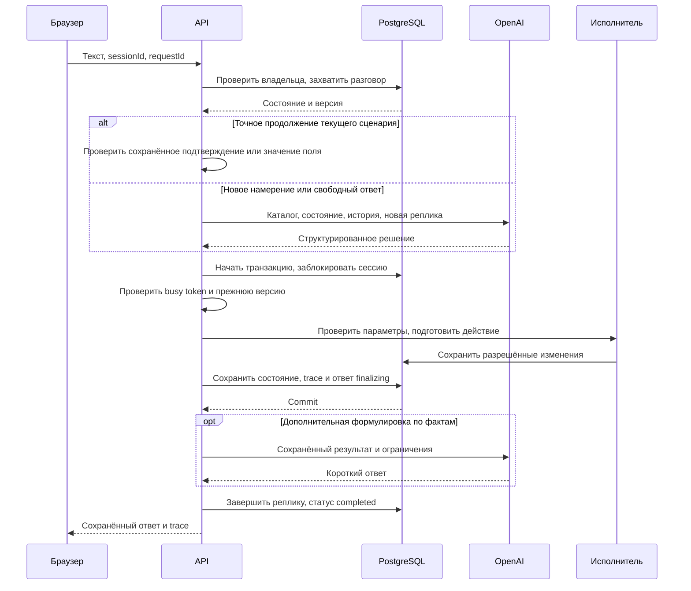

# Архитектура DIR ECHOES · Voice Router

Документ описывает **реализованную архитектуру** по исходному коду. Текущие проверки и оставшиеся задачи — в [PLAN.md](PLAN.md); настройка и запуск — в [OPERATIONS.md](OPERATIONS.md). Внешний production URL и проверка живой речи фиксируются отдельно от наличия реализации.

**Текущий production:** `bfaf300141ea47b54d602c7a3662626c63365fa5`, Vercel **Ready в 17:43, 23 сентября 2026 (Asia/Qyzylorda)**, deployment `dpl_3g2EJmw1QYZt87oLesdLYFYDHF6U`. [Приложение](https://dir-echoes-voice-router.vercel.app) · [неизменяемый адрес](https://dir-echoes-voice-router-hdu3iv35s-shadowocc.vercel.app). Финальная публикация уточняет мобильные отступы и контраст входа, документацию и материалы презентации; техническое описание и прежние проверки `901e228` ниже сохраняют свою историческую привязку. Нового benchmark или полной приёмки этим не заявляется.

**Последующее подтверждение пользователя:** связь работает («всё работает»). Это функциональное подтверждение на устройствах пользователя; отдельный протокол по браузерам/NAT, произношению RU/KK/mixed/TR и полная приёмка 40 сценариев не оформлены. Прежние отметки об ожидании ниже описывают состояние на время соответствующей проверки; измеренный SLA не заявляется.

Исторически в `156e2f7` опубликованы нативное воспроизведение через `HTMLAudioElement`, независимый измеритель копии MP3 через `OfflineAudioContext` и отдельный звёздный фон на весь viewport: **180** точек / **110** на мобильных. RMS TTS следует `audio.currentTime` примерно 15 раз/с после EOF и декодирования; до готовности копии уровень равен 0. Основная форма — до **3400** частиц / **1800** на мобильных; переходы состояния и 4-секундная сборка знаков не выдаются за измеренный звук. **60 FPS — цель, не измеренный FPS.** Выбранная птица сохранена. Статические списки языков убраны из клиентского UI; на той исторической версии ядро было ограничено RU/KK/TR. Текущий контракт допускает другие коды языков; их качество не измерено. Сбой тишины в desktop Codex IAB при auto/manual TTS ещё не признан устранённым.

Историческая браузерная проверка `5aac0b5` при **390×844, 390×500 и 844×390** не выявила горизонтального переполнения. Она не переназначается новому деплою и не проверяет физическую клавиатуру ОС или живое аудио.

**Опубликовано в `9688e01`:** TTS `marin` / `natural-v3`, локальный VAD 650 мс, источники `social` / `catalog_example`, Supervisor Live, перехват AI и браузерный WebRTC клиент ↔ оператор. Сложные деловые запросы сохраняют LLM; exact fast path не означает общую точность или скорость всего потока. Без настроенного TURN соединение через некоторые NAT не гарантируется.

**Имеющееся подтверждение:** локальный браузер при 1440×960 показал новый Live-экран, реальную сохранённую переписку в режиме просмотра и клиентскую голосовую сцену с чатом. В **17:26** пользователь подтвердил, что супервизор видит разговоры. Звонок не был найден, поскольку строка разговора ещё не выбрана. На момент 17:26 физическая слышимость ещё ожидала проверки; последующее подтверждение связи пользователем приведено выше.

**Опубликованный пакет `901e228`:** присутствие Live по heartbeat; тема обращения из фактического контекста; единая кнопка «Принять и позвонить» с окном «Подключиться к клиенту?» и отдельным согласием клиента; новый экран входа AuthGate с двумя ролями, нейтральной slate-палитрой, зелёным акцентом и белым знаком. Исправлено согласие после приветствия: при прежнем проверенном языке повторяется сохранённый preview и явный вопрос, при смене/непроверенном языке прежнее подтверждение сбрасывается с сохранением запроса. Прямой запрос оператора отделён от ответа на старый вопрос. Сборка и Ready подтверждены; новый полный benchmark и достижение 500 мс / 1,5 с не заявляются.

## Исторический пакет `0b9cf02`, включённый в `9688e01`

Изменения ниже впервые опубликованы в `0b9cf02` и входят в текущий `9688e01`. Публикация кода не заменяет голосовую и предметную приёмку:

- Языковой контракт принимает нормализованные ISO-коды, включая языки вне RU/KK/TR; сохраняет до четырёх конкретных кодов входа и ответа. `mixed` означает заявленное сочетание, `other` — один иной или не определённый язык. Старая запись `mixed` без массива по-прежнему читается как RU/KK.
- Для языков вне RU/KK/TR допускается перевод справочного результата на целевой язык. Перевод не подтверждает операцию: запись бизнес-данных и согласие на внешнее действие остаются доступны только в проверенных серверных формулировках RU/KK/TR. Явная просьба передать человеку допускается и на другом языке; сохранённый запрос не теряется. Качество новых языков не измерено.
- В опубликованном коде router и composer используют профиль `gpt-5.4-mini` с `reasoning_effort: none`; серверная настройка модели имеет приоритет, фактическая модель видна в trace. Доступность модели подтверждена чтением списка моделей аккаунта; это не проверка качества её ответов. Встроенные ставки оценки на 1 млн токенов: **$0.75 вход / $0.075 кэшированный вход / $4.50 выход**. Ускорение или повышение точности измерениями не заявляются.
- Приветствие и проверка связи отделяются от неясного бизнес-запроса: повторное «здравствуйте» не должно увеличивать счётчик неудачных уточнений или само отправлять к оператору. Приветствие с предметным вопросом сохраняет бизнес-намерение.
- Постоянный `error_events` сохраняет безопасные этап/код/время и внутренние ссылки независимо от повторной попытки реплики. Супервизор видит последние 50 событий. Точки записи технических ошибок подключены, пакет опубликован; сквозная приёмка журнала после retry пока не заявлена.

## Состав приложения

**Опубликовано в `156e2f7`:** описанные ниже независимый измеритель TTS и полноэкранный звёздный слой включены в текущий production. Пользователь сообщил: **в desktop Codex IAB не слышны ни автоматический ответ, ни ручное «Слушать ответ»**. Проверка слышимости после полного reload ожидается; изменение реализации не доказывает устранение тишины.

Один Next.js-проект содержит браузерное рабочее пространство и серверные API. Router, исполнитель и доступ к БД — модули одного приложения, а не отдельные микросервисы. Внешние зависимости runtime — OpenAI API и PostgreSQL; для облачной БД используется Neon, целевой хостинг — Vercel. NVIDIA Brev и отдельный интерфейс сменных inference-провайдеров в текущей реализации не используются.

| Компонент | Реализация и исходный код |
| --- | --- |
| Интерфейс разговора и микрофона | React, CSS, Lucide; [voice-workspace.tsx](../src/components/voice-workspace.tsx), [workspace-ui.tsx](../src/components/workspace-ui.tsx), [workspace-panels.tsx](../src/components/workspace-panels.tsx) |
| Голосовой цикл в браузере | Один запуск, локальное определение пауз по энергии сигнала, последовательная запись реплик; [use-voice-call.ts](../src/lib/use-voice-call.ts) |
| Воспроизведение и измерение | Один нативный аудиоэлемент, MSE / Blob; RMS декодированной копии полного MP3 синхронизирован с `audio.currentTime`, около 15 Гц; [audio-playback.ts](../src/lib/audio-playback.ts), [use-playback-meter.ts](../src/lib/use-playback-meter.ts) |
| Индикатор голоса | До 3400 частиц Canvas2D (1800 на мобильных), пакетная отрисовка, цель 60 FPS без замера; уровень микрофона и RMS декодированной копии TTS, когда она доступна; [voice-particles.tsx](../src/components/voice-particles.tsx) |
| Фоновый звёздный слой | На весь viewport разговора, 180 точек / 110 на мобильных, без реакции на звук и курсор; [background-starfield.tsx](../src/components/background-starfield.tsx) |
| Представление и контекст | Мобильная компоновка, голосовая сцена, раскрываемый прозрачный чат и навигация; тёмная тема по умолчанию с сохранением выбора; текущая тема, подтверждение и отложенные вопросы в [conversation-context.tsx](../src/components/conversation-context.tsx) |
| HTTP API | Next.js App Router, Node.js runtime; [route.ts](../src/app/api/%5B...path%5D/route.ts) |
| Авторизация | Подписанные cookie, роли participant / supervisor, проверка Origin; [auth.ts](../src/lib/auth.ts) |
| Оркестрация реплики | Захват разговора, запрос модели, транзакция действия и восстановление ответа; [conversation.ts](../src/lib/conversation.ts) |
| LLM, STT, TTS | OpenAI SDK, Zod / Structured Outputs, тайм-ауты и отключённые SDK-повторы; [ai.ts](../src/lib/ai.ts) |
| Быстрое продолжение | Точное согласие / отказ и атомарное значение запрошенного поля; [fast-path.ts](../src/lib/fast-path.ts) |
| Политика диалога | Параметры, очереди тем, уточнения, подтверждение; [domain.ts](../src/lib/domain.ts) |
| Исполнитель | 31 разрешённое действие, сначала план изменений, затем запись; [domain-actions.ts](../src/lib/domain-actions.ts) |
| Данные и расчёты | Нормализация, формулы набора, даты и доступные источники знаний; [domain-data.ts](../src/lib/domain-data.ts) |
| Хранение | PostgreSQL / pg, локальная PGlite, транзакции и схема; [db.ts](../src/lib/db.ts), [repository.ts](../src/lib/repository.ts) |
| Импорт | Проверки каталога и SHA-256; [dataset.ts](../src/lib/dataset.ts), [import-dataset.ts](../scripts/import-dataset.ts) |
| Расходы | Общий журнал резервирования оценочной стоимости; [budget.ts](../src/lib/budget.ts) |
| Супервизия | Ручная оценка маршрута, метрики, версии описаний каталога; [supervision.ts](../src/lib/supervision.ts), [supervisor-tools.tsx](../src/components/supervisor-tools.tsx) |
| Общие контракты | Типы состояния, решений, действий и trace; [types.ts](../src/lib/types.ts) |

## Жизненный цикл реплики

После одного нажатия «Начать разговор» браузер выделяет отдельные реплики локальным VAD и отправляет каждую завершённую запись в STT. Полученный текст проходит тот же серверный путь, что и текстовый ввод. Смысловая маршрутизация выполняется LLM по всему каталогу; энкодерный классификатор не применяется. Во время обработки и озвучивания захват новых реплик приостановлен.

Последовательность в [processTurn](../src/lib/conversation.ts):

1. Проверить доступ к разговору и ограничение частоты. В транзакции заблокировать строку сессии, проверить повтор `requestId`, статус и действующий захват обработки.
2. Создать реплику `processing`, записать `busy_token` и `busy_until` на 100 секунд. Сохранить текущую версию для последующей проверки.
3. Проверить узкое продолжение текущего сценария. При отсутствии точного совпадения вызвать LLM-router **вне SQL-транзакции**. Модель получает каталог сценариев, состояние и последние сообщения; dev-метки ей не передаются.
4. В новой транзакции заблокировать сессию и сверить токен и версию. Только после этого передать решение исполнителю.
5. Зафиксировать изменения сущностей, результат операции, новое состояние, очередь при необходимости, trace и ответ исполнителя. Реплика получает статус `finalizing`.
6. При необходимости отдельно улучшить формулировку ответа по фактам. Preview, вопрос о недостающем параметре, ошибка и handoff не проходят этот дополнительный этап.
7. Сохранить окончательный ответ как `completed` и освободить захват. Если улучшение формулировки не удалось, используется уже сохранённый ответ исполнителя.

Таким образом, необязательная генерация текста не является условием сохранности выполненного действия.

## Решение LLM и серверная политика

В [ai.ts](../src/lib/ai.ts) проверяются идентификаторы, структура и типы ответа. В `0b9cf02` опубликован профиль router и composer `gpt-5.4-mini` с `reasoning_effort: none`; модель задаётся серверной настройкой. Профиль оценки использует $0.75 / $0.075 / $4.50 за млн обычных входных / кэшированных входных / выходных токенов. Показатели прежнего `gpt-4.1-mini-2025-04-14` не переносятся на новую модель. Каталог включает все 40 сценариев с описаниями, границами `not_this_if` и примерами. Проверочные ответы не зашиты в runtime.

Результат содержит список сценариев с уверенностью и кратким обоснованием, альтернативы, параметры, признак продолжения, подтверждение / отказ, вопрос для уточнения и `utteranceKind`. В контракте `0b9cf02` `language` / `responseLanguage` допускают `ru`, `kk`, `tr`, `mixed`, `other`; `inputLanguages` / `responseLanguages` хранят до четырёх нормализованных базовых ISO-кодов. Один иной код, например `it`, соответствует `other`; несколько конкретных кодов — `mixed`. Старые записи `mixed` без массива читаются как RU/KK только для совместимости. Код проходит синтаксическую нормализацию через `Intl.Locale`, что не является обещанием качества языка. `tone` влияет на формулировку, но не разрешения и правила действий. Уверенность модели — эвристическая оценка, не калиброванная вероятность.

Исполнитель применяет пороги кейса: от 0,75 — обработка сценария; неоднозначность между 0,45 и 0,75 — уточнение; после двух низкоуверенных неразрешённых запросов предлагается передача оператору. Клиент подтверждает её до создания обращения. Прямая просьба о человеке создаёт handoff без дополнительного согласия только при уверенности не ниже 0,75, без альтернатив и вопроса для уточнения. Срочные сценарии обрабатываются перед остальными; другие намерения сохраняются.

Язык и границы намерений остаются предметом оценки. Исходный каталог и редактор содержат RU/KK-примеры; расширенный набор ISO-кодов не является измерением качества TR, итальянского или других языков. Полного актуального языкового прогона и человеческой проверки TR пока нет. Строгая JSON Schema обеспечивает форму ответа, но сама по себе не доказывает правильность сценария или языка.

[Быстрое продолжение](../src/lib/fast-path.ts) не выбирает новое намерение. Оно принимает точное «да / иә / нет / жоқ» только при соответствующей сохранённой операции либо одно атомарное значение ожидаемого поля, проверенное нормализатором каталога. Свободный текст, смена темы и неоднозначные ответы идут в LLM. Булевы ответы на произвольно сформулированные вопросы не перехватываются. Trace различает `llm`, `slot` и `confirmation`; быстрый маршрут имеет нулевую стоимость вызова router.

## Состояние, действия и подтверждение

`DialogueState` хранит активный сценарий, отложенные и прерванные темы, параметры отдельно по сценарию, найденного клиента, ожидаемую операцию, последний вопрос, число неуспешных уточнений и язык ответа. Версия и владелец находятся в строке `sessions`.

[routing-slots.ts](../src/lib/routing-slots.ts) дополняет 43 исходных определения двумя параметрами исполнения из правил продуктов: `package=Standard/Lite` для SC03 и `term_months=6/12` для SC01/SC02. Исходный набор и его хеш не меняются. Для SC34 признак неудачной помощи сохраняется до подтверждения передачи и очищается при отказе или смене темы. После подтверждённой смены телефона обновляются только совпадающие со старым номером ссылки в контекстах текущего клиента; проверка принадлежности записей сохраняется.

[Исполнитель](../src/lib/domain-actions.ts) содержит все **31 действие** из каталога. Он проверяет необходимые параметры самого действия, даже если сценарий отметил часть из них необязательными. Проверяется принадлежность полиса / заявления; для обращения пострадавшего по чужому ОГПО возвращается ограниченный результат проверки полиса виновника. Для отсутствующего тарифа или внешней доступности результат не придумывается.

Статусы результата действия: `read`, `preview`, `executed`, `queued`, `failed`. Отдельного статуса действия `confirmed` в контракте нет: подтверждение выражается сохранённой операцией и переходом к исполнению.

Перед любым изменением бизнес-сущностей, созданием outbox-запроса или автоматической передачей специалисту сохраняются operation ID, параметры и человекочитаемое описание. Preview не записывает бизнес-сущности. Контрольная SHA-256 подпись охватывает все запланированные изменения и передачу; случайные ID и технические временные метки нормализуются, чтобы одинаковые условия не требовали повторного согласия. Исполнение использует сохранённые параметры; их изменение либо изменение условий требует нового подтверждения. Выполненный результат хранится как `entities(kind='operations')`, поэтому повтор того же подтверждения возвращает сохранённый результат.

Справочные чтения по запросу клиента не требуют дополнительного согласия. Рекомендации звонить 112 и не раскрывать коды при подозрении на мошенничество выдаются сразу, до уточнения параметров или подтверждения записи. Отказ от предложенной передачи возвращает сохранённую тему диалога; неясный ответ на предложение передачи оставляет безопасное ожидание согласия.

HTTP-идемпотентность обеспечивается отдельно через уникальную пару `turns(session_id, request_id)`. Повтор завершённого запроса возвращает историю; использование того же ключа с другим текстом или режимом отклоняется.

## Фактическая схема хранения

Схема создаётся в транзакции с advisory lock для последовательной инициализации независимых серверных процессов. См. [db.ts](../src/lib/db.ts) и [budget.ts](../src/lib/budget.ts).

| Таблица | Назначение |
| --- | --- |
| `dataset_versions` | Текущий импортированный набор, каталог, знания, метаданные и хеш |
| `sessions` | Владелец, состояние, версия, захват обработки и время обновления |
| `turns` | Реплика, ответ, trace, mode, request ID и стадия обработки |
| `entities` | Общая таблица kind/id/data для бизнес-сущностей и результатов операций |
| `handoffs` | Очередь, причина, резюме и waiting/active/closed; не более одного открытого обращения на сессию |
| `operator_commands` | Автор, содержимое и сохранённый результат команды оператора для безопасного повтора |
| `operator_voice_calls` | Временные offer/answer SDP, call ID, оператор и сроки браузерного WebRTC; аудиозаписи не хранятся |
| `error_events` | Постоянные безопасные категории технических сбоев и ссылки |
| `session_presence` | Присутствие клиента по heartbeat с истечением срока; опубликовано в `901e228`, не является записью речи |
| `rate_limits` | Общие ограничения частоты |
| `speech_audio` | Аудио сохранённого ответа, хеш текста и время первого байта |
| `speech_content_leases` | Временный захват TTS по содержимому для защиты от одновременного синтеза |
| `ai_budget_days`, `ai_budget_ledger` | Оценочная сумма по суткам UTC, резервирование и закрытие API-вызовов |
| `review_annotations` | Ожидаемый основной сценарий и комментарий супервизора к завершённой LLM-реплике |
| `catalog_revisions` | Версии редактируемых описаний и примеров поверх исходного каталога, цепочка хешей и автор |

В `entities` находятся `clients`, `policies`, `claims`, `payments`, `operations`, `outbox`, `complaints`, `callbacks`, `disputes`, `appointments`, `inspections`, `fraud`. Отдельных таблиц `scenario_catalog`, `knowledge` и `action_runs` нет; сведения о действиях хранятся в trace реплик и в результате операции.

Импорт читает официальный каталог из внешнего `DATASET_PATH`, проверяет состав и ссылки, вычисляет SHA-256 и сохраняет данные в PostgreSQL. Повтор той же версии не перезаписывает изменённые записи. Другой хеш требует явной миграции. Runtime на Vercel читает данные из БД, исходная папка на сервере ему не нужна.

Дата бизнес-правил — `scenarios.meta.as_of_date`, сейчас 2026-10-01. Переменная окружения не переопределяет эту дату. Время технических событий сохраняется независимо от неё.

## Supervisor Live и голос человека

В `9688e01` супервизор после входа открывает Live. Список и выбранная история обновляются примерно каждые 2 секунды; API возвращает до 100 последних сессий. Это polling, а статус AI не доказывает текущую речь клиента. Пользователь подтвердил видимость разговоров в 17:26, не произвольный объём списка. В `901e228` опубликован heartbeat присутствия с фазами listening/processing/replying и сроком 15 секунд; просроченный LIVE исчезает. Это сигнал состояния приложения, не акустическое доказательство речи.

[operator-workbench.tsx](../src/components/operator-workbench.tsx) вызывает `POST /api/sessions/:id/takeover` со стабильным request ID. Сервер блокирует session, устанавливает handoff, очищает ожидающее согласие, меняет version/busy token и сохраняет событие. Поздняя AI-реплика не должна перезаписать перехват; ранее подтверждённые изменения не отменяются. Клиентский polling останавливает захват и озвучивание AI.

[operator-voice-controls.tsx](../src/components/operator-voice-controls.tsx) и [operator-rtc.ts](../src/lib/operator-rtc.ts) реализуют отдельный браузерный WebRTC. Нужно выбрать строку и нажать «Принять и позвонить», затем в окне с темой обращения — «Подтвердить и позвонить»; клиент отдельно нажимает «Принять звонок». Для уже принятого обращения кнопка называется «Позвонить клиенту». Обе стороны разрешают микрофон. Offer/answer передаются через авторизованный временный сигналинг. Аудио не записывается и не отправляется в STT; это не SIP/PSTN. По умолчанию доступен STUN; для некоторых NAT требуется TURN. Connected сам по себе не доказывает слышимость; пользовательское подтверждение работоспособности связи получено позднее.

## Очередь супервизора

Handoff сохраняет очередь, причину и резюме вместе с изменением состояния разговора. В состоянии `handoff` новые сообщения клиента сохраняются для оператора без нового вызова router.

После подтверждения запрос приёма создаёт связанное обращение в `medical_assistance_24_7`, осмотра — в `claims_team`, обратного звонка — в `operator_general`. Бизнес-запись хранит очередь и идентификатор разговора, а причина handoff содержит номер запроса. Супервизор согласует исполнение через очередь и историю. Принятие обращения само по себе не подтверждает внешнее расписание или состоявшийся звонок.

При принятии и закрытии создаются отдельные operator-реплики в истории. Текст оператора также сохраняется как реплика. Закрытие переводит и обращение, и разговор в завершённое состояние. Назначение конкретного сотрудника и персональные аккаунты операторов не реализованы: действие доступно авторизованной роли supervisor.

Команда оператора сохраняется в `operator_commands` одной транзакцией с сообщением и изменением очереди. Пара `(handoff_id, request_id)` уникальна; хеш связывает повтор со статусом и текстом, а actor_id — с браузерной идентичностью супервизора. При повторе возвращается исходный результат даже после закрытия обращения. Новый запрос к уже закрытому обращению отклоняется. История и сводка очереди содержат ответы оператора.

Порядок блокировки при изменении очереди: **сначала строка sessions, затем handoffs**. Обработка клиентской реплики проверяет версию и захват ещё раз внутри транзакции, чтобы не записать ответ поверх закрытого или изменённого обращения. Исходный код — [API очереди](../src/app/api/%5B...path%5D/route.ts), [conversation.ts](../src/lib/conversation.ts).

### Языковая граница операций в `0b9cf02`

На языках вне проверенных RU/KK/TR composer получает отдельный фактический текст для перевода. Он не получает право выполнить действие, сформировать согласие или перевести неподтверждённый preview в разрешение. Если входной или целевой язык операции не входит в проверенные, сервер сохраняет запрос, блокирует запись и предлагает выбрать проверенный язык либо человека. Явная просьба об операторе остаётся разрешённым исключением для передачи контекста. При сбое перевода возвращается явная пометка `[LANGUAGE_TRANSLATION_REQUIRED]`; равное качество всех языков не гарантируется.

## Ручная оценка и версии каталога

Супервизор сохраняет ожидаемый основной сценарий и комментарий к завершённой LLM-реплике. Повторная оценка того же автора обновляет его запись; агрегат использует последнюю оценку на реплику. Отдельно показываются доля просмотренных реплик, согласие с оценкой, ошибки действий и p50/p95 router и сервера по источнику. Эти показатели описывают сохранённые разговоры и ручную выборку, а не точность на всём наборе.

Редактор допускает название, описание, RU/KK-примеры и границы `not_this_if` существующих 40 сценариев. Действия, тарифы и исходные записи организатора через него не меняются. Новая версия сохраняется поверх исходного каталога с базовым и родительским хешами; оптимистическая проверка версии предотвращает перезапись чужой правки. Trace следующей маршрутизации содержит фактически использованный хеш. Исходный код — [supervision.ts](../src/lib/supervision.ts).

## Голос и наблюдаемость

Путь опубликованной версии `156e2f7` — **микрофон → локальный VAD → MediaRecorder → загрузка завершённой реплики → STT → router → исполнитель → потоковый TTS → воспроизведение → следующая реплика**. «Начать разговор» запускает этот браузерный цикл один раз. STT остаётся обработкой отдельных файлов: потокового входного распознавания, телефонного соединения и автоматического голосового перебивания нет.

В [use-voice-call.ts](../src/lib/use-voice-call.ts) VAD использует RMS и адаптивный порог шума; это детектор энергии, а не модель, надёжно отличающая речь от фоновых звуков. Первичная оценка фона занимает около **320 мс** (`calibrating`), после ответа действует интервал **250 мс** (`settling`). В опубликованном `9688e01` реплика завершается после **650 мс** тишины; прежние 950 мс относятся к `0b9cf02`. Задержка PCM **500 мс** сохраняет начало фразы, в том числе короткую речь во время настройки или восстановления прослушивания; начало голоса требует около **60 мс** активности. Анализ выполняется каждые 20 мс, публикация уровня микрофона — примерно 10 раз в секунду. Максимальная запись — 45 секунд / 3 МБ. Постоянный шум оценивается при запуске; музыка, импульсы и речь на протяжении всей калибровки всё ещё способны дать ошибку. Новые параметры не считаются принятыми на живом микрофоне.

Во время STT, обработки, синтеза и воспроизведения закрывается аудиозатвор входа в запись; новая реплика не создаётся. После ответа прослушивание возобновляется. Кнопка «Перебить ответ» вручную прекращает воспроизведение и позволяет снова говорить. Это последовательный разговор, а не автоматический full-duplex/barge-in. Остановка разговора, смена экрана или сессии, скрытие вкладки и уход со страницы освобождают дорожки микрофона; остановка клиента не откатывает уже сохранённое бизнес-действие.

STT по умолчанию — `gpt-transcribe`, TTS — `gpt-4o-mini-tts`. Опубликованный профиль [speech-profile.ts](../src/lib/speech-profile.ts) задаёт `marin` и версию `natural-v3`; профиль участвует в хеше аудиокэша. Профиль опубликован в `9688e01`. Серверный TTS передаёт поступающие аудиофрагменты браузеру и сохраняет завершённый результат в `speech_audio`; `speech_content_leases` ограничивает одновременные повторные запросы. Ошибка озвучивания не удаляет сохранённый текст. Само наличие потока не доказывает слышимость или целевую задержку нового голосового цикла.

[audio-playback.ts](../src/lib/audio-playback.ts) сохраняет один `HTMLAudioElement` для рабочего пространства. `unlockAudioPlayback` вызывает `play()` локального тихого WAV непосредственно в пользовательском жесте; позднее тот же элемент получает реальный ответ. Поток проигрывается через MSE, если формат поддержан; иначе этот же HTTP-ответ загружается как Blob. Проверки отмены и поколения выполняются после асинхронного чтения и перед воспроизведением; завершение старой подготовки не ставит новый ответ на паузу. Ожидание `sourceopen` / `updateend` ограничено 15 секундами. Серверный кэш сохраняется только после полного получения аудио; отмена не выдаётся за успешно завершённый синтез.

[use-playback-meter.ts](../src/lib/use-playback-meter.ts) декодирует **копию полностью полученного MP3** через `OfflineAudioContext`, вычисляет RMS по окнам PCM и примерно **15 раз в секунду** выбирает уровень по `audio.currentTime`. Измеритель не создаёт живой `AudioContext`, `MediaElementSource` или маршрут к `destination` и не вызывает `play`, `pause`, `load` либо `resume`: нативный аудиоэлемент остаётся под управлением воспроизведения. При MSE копия доступна после EOF; до полного получения и декодирования уровень равен **0**, без искусственной имитации речи. Пауза, окончание, отключённая громкость, скрытая вкладка или ошибка декодирования также обнуляют уровень. При размонтировании снимаются обработчики и отменяется измерение; нативный звук этим анализатором не перехватывается. Декодированный RMS не доказывает физическую слышимость.

[Органичная форма до 3400 частиц (1800 на мобильных)](../src/components/voice-particles.tsx) получает `micLevel` во время прослушивания/речи клиента и RMS декодированного ответа при доступной полной копии TTS. Активная форма увеличена; прослушивание собирает её компактнее, ответ раскрывает шире. Эти переходы показывают состояние и отделены от измеренной звуковой деформации; нулевой RMS не заменяется выдуманным уровнем. В светлой теме используется контрастный графит. Canvas использует пакетную отрисовку с целью 60 FPS без измерения достигнутой частоты, учитывает уменьшение движения и останавливается в скрытой вкладке.

[BackgroundStarfield](../src/components/background-starfield.tsx) рисует отдельный звёздный фон **по всему viewport**: 180 точек на больших экранах, 110 на мобильных. Фон расположен под содержимым только в режиме разговора, не перехватывает нажатия и не получает аудио, курсор или состояние диалога. Он больше не ограничен центральным canvas; его целевой темп — 30 кадров/с, с DPR до 1,5 и остановкой в скрытой вкладке. Частота не измерена на устройстве.

В готовящемся пакете trace также различает `social` и `catalog_example`: точные стартовые пути из [fast-path.ts](../src/lib/fast-path.ts), без нового вызова модели.

Trace хранит сценарии, альтернативы, краткое объяснение, язык входа и ответа, параметры, действия, модель, хеш каталога, usage, предупреждения и времена этапов. Для текстового ввода STT равен `null`. Общая панель считает разговоры / реплики / открытые обращения и медиану router. Супервизия дополнительно вычисляет p50/p95 router и серверной обработки отдельно для LLM, значения поля и подтверждения.

Интерфейс строится вокруг чёрной голосовой сцены и учитывает мобильную ширину и высоту экрана. Навигация и кнопки разговора остаются отдельными от раскрываемого прозрачного слоя чата; «Чат» показывает расшифровку и ввод, «Весь разговор» раскрывает историю вместо последней реплики. Полезные подсказки показывают текущую тему, ожидаемое подтверждение, передачу оператору и сохранённые вопросы для продолжения. «Подсказки» управляет панелью, «Показать логику ответа» раскрывает trace. Скрытие панелей не прекращает сохранение трассировки. При отсутствии выбора используется **тёмная тема**; светлая и тёмная темы доступны на входе и в рабочем пространстве, выбор сохраняется в `localStorage`. Исторически на `5aac0b5` проверены браузерные размеры 390×844, 390×500 и 844×390 без горизонтального переполнения; реальная клавиатура ОС и Safari остаются отдельной проверкой.

Медиана router, первый байт TTS и начало воспроизведения — разные показатели. Формальная цель 500 мс на router не достигнута. Полная задержка от окончания живой речи до слышимого ответа требует отдельного браузерного замера.

### Постоянный журнал технических ошибок — `0b9cf02`

`error_events` хранит независимые записи с этапом, фиксированным безопасным кодом/сообщением, временем БД, HTTP-статусом и внутренними UUID разговора/реплики. Повторная попытка может заменить failed-реплику, но не удаляет событие журнала; FK на удаляемую реплику отсутствует намеренно. `recordErrorEvent` не читает raw provider body, `error.message`, стек, текст клиента или аудио. Ошибка записи возвращает `null` и не заменяет исходный сбой. Супервизия показывает последние 50 событий и только существующие ссылки; точки записи серверных ошибок подключены; сквозная приёмка остаётся отдельным шагом. Исторические ошибки задним числом не восстанавливаются.

## Поведение при отказах

| Ситуация | Что делает код | Что остаётся проверить / выполнить |
| --- | --- | --- |
| Router вернул ошибку, тайм-аут или невалидный контракт | Исполнитель не запускается; реплика помечается failed, пользователь получает ошибку; скрытых SDK-повторов нет | Повторить запрос после устранения причины; новый вызов может тарифицироваться |
| Ошибка дополнительной формулировки | Остаётся сохранённый ответ исполнителя; в trace добавляется предупреждение | Действие не нужно выполнять заново |
| Процесс остановился после commit действия | Сохранены сущности, состояние, trace и ответ finalizing; после истечения захвата чтение истории восстанавливает completed | До истечения захвата обработка может оставаться занята; срок захвата — 100 секунд |
| Повтор завершённого request ID | Возвращается сохранённый результат; другая реплика с тем же ключом даёт 409 | Клиент должен повторно использовать исходный ID только для того же запроса |
| Одновременные реплики / изменение состояния | Строковая блокировка, busy token и прежняя версия защищают запись; конфликт возвращает 409 | Обновить историю и повторить незавершённый ввод |
| БД недоступна | Сервер не заявляет успешное сохранение, возвращает ошибку; автоматической офлайн-очереди нет | Восстановить соединение и проверить историю перед повтором |
| STT или TTS недоступен | Возвращается ошибка соответствующего API; сохранённый текст остаётся доступным | Продолжить текстом; отдельно проверить модель, доступ и запись |
| AI-лимит исчерпан или исход вызова неизвестен | Новый вызов блокируется; неопределённый резерв не освобождается автоматически | Сопоставить журнал приложения и биллинг провайдера |
| Внешняя доставка / оплата / расписание не подключены | Сохраняется queued / pending_payment / request_pending без ложного завершения | Обработать через супервизора или подключить разрешённый внешний сервис |

Это описание существующих механизмов, а не утверждение о проведённых испытаниях всех отказов на production.

## Доступ и границы внешних систем

Сессия подписывается сервером, роли проверяются на API. HMAC-токены имеют разные назначения: session хранит роль и действует 12 часов; browser_identity хранит только идентификатор браузера на 30 дней и не восстанавливает доступ сам по себе. Участник видит свои разговоры; супервизор — общую историю и очередь. Идентичность участника связана с cookie браузера. Общие коды ролей не заменяют персональные аккаунты и MFA. Поиск клиента по идентификатору из кейса не является проверкой владения телефоном через OTP.

Телефоны, ИИН и email распознаваемых письменных форм маскируются в выдаваемых браузеру данных; UUID, даты и номера полисов сохраняются. Перед текстовым router персональные значения заменяются непрозрачными ссылками с новым случайным пространством имён для каждого запроса. Карта исходных значений остаётся в памяти сервера; восстановление разрешено только для извлечённых слотов перед доменной валидацией. Неизвестная ссылка отклоняется. Причины выбора и уточнения не восстанавливают персональные значения. Composer получает маскированные факты, действия, историю и запасной ответ.

Это дополнительная защита распознаваемых телефонов, ИИН, email и структурированных идентификаторов, а не универсальный поиск имён и адресов в свободной речи. Аудио передаётся внешнему STT до текстовой обработки, поэтому интерфейс прямо требует использовать только вымышленный набор кейса и не произносить реальные персональные данные. Исходный набор и ключи не помещаются в public или клиентский код. Режим для настоящих клиентских данных этим проектом не заявляется.

Данные организатора представляют вымышленную Saqta Insurance. Исполнитель реально меняет записи этого набора, но не подключён к продуктивной системе страховой компании. Новые полисы имеют `pending_payment`, доставка хранится в outbox, запись к врачу / на осмотр — как запрос без подтверждённого времени. Внешний SMS, телефонный перевод, эквайринг и расписание не считаются выполненными.

## Измеренные результаты и открытые проверки

| Проверка | Подтверждённый результат | Ограничение |
| --- | --- | --- |
| Базовый полный dev-прогон, 104 реплики | Основной сценарий 99/104 (95,19%); полный набор 97/104 (93,27%); mixed 7/7; median router 2308 мс; около 0,294 USD | Только текстовый router, новый диалог на реплику; открытый небольшой набор |
| Выборочная проверка границ v4, 25 реплик | Полное совпадение **25/25**, вместо **18/25** в базовой версии на тех же репликах; исправлены все 7 выбранных ошибок, регрессий на этой выборке нет | Реплики отобраны по ошибкам и соседним случаям; **полного повторного прогона 104 реплик после изменений не было** |
| Язык в выборке v4 | Отчёт зафиксировал **2 ошибки языка**: U012 и U078, ожидается kk, возвращены ru и responseLanguage=ru | Результат 25/25 относится к сценариям; последующие языковые правки не переоценены полным прогоном |
| Локальное приложение и Neon | Вход участника, сохранение разговора и первая реплика по расчёту подтверждены | Проверка опубликованной версии выполняется отдельно |
| Связность речевых API | TTS вернул MP3 61 056 байт; STT распознал сгенерированный ответ с HTTP 200 за 2084 мс | Это не живая запись человека и не тест code-switching |
| Историческая опубликованная версия `0661777` | Ready, вход, 40 сценариев, супервизорский API и сохранённая история | Эти проверки выполнены на указанной прежней версии; текущий deployment приведён следующей строкой |
| Текущий production `901e228` | Ready в 17:38, локальные TypeScript/build 17:37–17:38 и Vercel build прошли | Пользователь ранее подтвердил работу связи; локальный осмотр 1440×960 относится к предшествующему UI, не к полному benchmark новой версии |
| Два локальных запуска `pnpm launch` | Валидация набора 40/43/31, production-build, старт на 13301 | Не доказывают слышимость, языковое качество или текущие unit/API-тесты нового пакета |

Выборочная v4-проверка имела median router **2393 мс** и оценочную стоимость **0,0297556 USD**. Подробные отчёты находятся локально в исключённых из Git каталогах `reports/routing-v1/` и `reports/routing-boundaries-v4/`; тексты исходного набора не публикуются. Скрипт полного evaluator — [evaluate.ts](../scripts/evaluate.ts).

Быстрый маршрут измерялся отдельно на подготовленных состояниях проверки: **12 допустимых и 23 отклоняемых случая**, 1200 локальных повторений, без API; median **0,005 мс**, p95 **0,013 мс**, максимум **1,466 мс**. Три парных сравнения с обычной LLM дали совпадающие сценарий, параметры и подтверждение: число — 0,034 против 5893 мс; дата на казахском — 0,173 против 2709 мс; подтверждение смешанного диалога — 0,043 против 1927 мс. Суммарная оценка этих трёх API-вызовов — **0,0063804 USD**. Отчёты: `reports/fast-path-v1/report.json` и `reports/fast-path-v1-final-local/report.json`. Это измерение узких продолжений, не новый показатель точности намерений, не клиентские продуктовые данные и не сквозная задержка речи.

Приоритет — сохранить форму организатора до 17:50 и записать подробные результаты пользовательской приёмки на `901e228`. Связь пользователем подтверждена, новые Live/согласие/вход опубликованы. Исторические языковые оценки и viewport не заменяют проверку нового пакета.

## Отдельные пользовательские trace, 17:23

| Реплика | STT | Router | Доп. формулировка | TTS до первого байта | Конец речи → воспроизведение |
| --- | ---: | ---: | ---: | ---: | ---: |
| Приветствие, `social`, аудио из кэша | 598 мс | 1,738 мс | — | кэш | 1730 мс |
| Деловой запрос, LLM: наблюдение 1 | 641 мс | 1670 мс | 0 мс | 1058 мс | 4599 мс |
| Деловой запрос, LLM: наблюдение 2 | 867 мс | 1292 мс | 882 мс | 662 мс | 5012 мс |

Серверный trace приветствия — **66 мс**. Это три отдельных наблюдения реального приложения, не средние показатели и не новый benchmark. Событие воспроизведения не заменяет подтверждение физической слышимости человеком. Цели **500 мс для полного LLM-router** и **1,5 с до голоса** не достигнуты этими примерами. Исторические 104 dev-реплики не оценивают текущую модель, живую речь или новые языки.

`serverTotal` фиксируется до завершающего UPDATE реплики, загрузки результата и освобождения busy token. `ttsFirstByte` измеряется внутри синтеза и не включает предварительные auth/cache/lease-запросы `/speech`. Сумма этих полей не равна полному времени до слышимого ответа.

## Финальный интерфейс `901e228`

[auth-gate.tsx](../src/components/auth-gate.tsx) отделяет вход от рабочего пространства, сохраняя прежний серверный контракт авторизации. [operator-workbench.tsx](../src/components/operator-workbench.tsx) показывает тему из фактического контекста и наличие свежего heartbeat; единая кнопка звонка использует нативный dialog с темой и отдельное принятие клиентом. Локальные TypeScript/build прошли 17:37–17:38; публикация подтверждена Ready.
