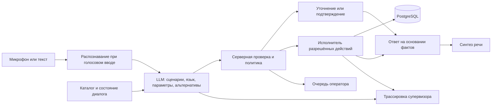

# Архитектура Voice Router

Статус: предложение на основании полного ТЗ и аудита стартового набора. Реализация и её проверки отслеживаются в PLAN.md. Приоритет — работающий сквозной сценарий и правильная маршрутизация; пороги задержки являются бонусом по ТЗ.

## Продукт

Один рабочий интерфейс для разговора и проверки решения, история разговоров, каталог сценариев и очередь операторов. Каждый видимый показатель вычисляется по сохранённым событиям. Пока данных нет, показывается пустое состояние. Результаты действий имеют реальные статусы: preview, confirmed, executed, failed, queued.

Пользователь говорит или пишет; система определяет нужные сценарии, уточняет детали по одному вопросу, исполняет действия и отвечает на языке клиента. Супервизор видит короткую причину выбора и использованные факты, а не скрытые рассуждения модели.

## Предлагаемый стек

| Слой | Выбор | Причина |
| --- | --- | --- |
| Интерфейс и сервер | Next.js App Router, React, TypeScript | Один репозиторий и деплой на Vercel, общие типы |
| Оформление | Tailwind CSS, доступные компоненты, Lucide | Быстрая реализация рабочего интерфейса |
| Контракты | Zod и строгая JSON Schema | Проверка пользовательского ввода и решения LLM |
| Постоянные данные | PostgreSQL, предпочтительно Neon через Vercel | Сохранность после обновления страницы и деплоя, транзакции |
| Маршрутизация | OpenAI gpt-4.1-mini, фиксированный snapshot | Structured Outputs; доступ проверен коротким запросом |
| Распознавание | Настраиваемый OpenAI STT; начальный кандидат gpt-transcribe | RU/KK и переключение языков; доступ и качество ещё проверить |
| Синтез | gpt-4o-mini-tts | Голосовой ответ; качество русского и казахского проверить в браузере |
| Хостинг | Vercel | Прямое требование пользователя |

GPU в NVIDIA Brev не является обязательной зависимостью. Предоставленная учётная запись Brev предназначена для вычислительных ресурсов, а не заменяет ключ модельного inference API. Возможность подключить собственную модель оставляется в интерфейсе провайдера.

## Обработка реплики

LLM получает компактные описания всех 40 сценариев с `not_this_if`, 3 системных намерения, до 10 реплик и состояние. Проверочный файл и ожидаемые ответы не входят в runtime-промпт. Первый вариант не отсекает сценарии энкодерным классификатором и не обучается на скрытых репликах.

Сервер валидирует ID и параметры; срочные сценарии ставит первыми; остальные сохраняет в очереди. Пороги 0.75 и 0.45 из стартового кита используются как явная политика. Значение confidence — оценка модели, а не измеренная вероятность правильности. Один короткий уточняющий вопрос при неоднозначности; два неуспеха или просьба клиента переводят обращение в очередь оператора.

## Состояние и действия

В состоянии разговора: активный сценарий, отложенные и прерванные темы, параметры по сценариям, найденный клиент, ожидаемое подтверждение, число неуспешных уточнений, язык, версия состояния. Смена темы не уничтожает незавершённую операцию.

Исполнитель учитывает обязательные входы самого действия, даже если сценарий помечает их необязательными. Принадлежность полиса/страхового случая клиенту проверяется сервером. Формулы и ограничения берутся из базы знаний. Пробелы в исходных правилах вызывают уточнение или передачу оператору, а не выдуманный тариф.

Перед необратимым действием сохраняется preview с точными параметрами и operation ID. Подтверждение привязано к этому preview; изменение параметров требует нового подтверждения. Повтор HTTP-запроса не создаёт повторное действие. Идемпотентность нужна также для обратного звонка, жалобы и постановки сообщения в очередь.

Дата бизнес-правил задаётся набором: 2026-10-01. Времена технических событий сохраняются в фактическом UTC. Эти две даты не смешиваются.

## Постоянное хранение

- sessions: состояние, владелец, статус, версия;
- turns: реплика, результат, язык, request ID, метрики, unique(session, request);
- scenario_catalog и knowledge: импортированные версии и хеш происхождения;
- clients, policies, claims, payments: сущности набора и контролируемые изменения;
- action_runs: preview, подтверждение, результат/ошибка, ключ идемпотентности;
- handoffs: очередь, причина, резюме, статус, назначенный оператор;
- outbox: запросы к внешним каналам с честным статусом доставки;
- review_annotations: исправления супервизора для статистики подтверждённых ошибок.

Вызов LLM не держит открытую SQL-транзакцию. Изменение состояния выполняется атомарно с проверкой версии. Сырой датасет и ключи не попадают в public/ и клиентский bundle. Клиент получает только данные разрешённого разговора; доступ супервизора проверяется сервером.

## Голос и метрики

Первый полный цикл: MediaRecorder → ограниченный по длительности/размеру upload → STT → router → действие/ответ → TTS → воспроизведение. Выбор поддерживаемого MIME проверяется в браузере. Текст работает при отказе микрофона, но не считается выполнением требования голосового ввода.

Отдельно измеряются STT, полный вызов router с валидацией JSON, исполнение, подготовка ответа, первый аудиобайт и начало воспроизведения. От отправки записи до воспроизведения и от фактического конца речи до воспроизведения — разные показатели; второй требует реального определения конца речи. Для текста STT отсутствует, а не имеет фиктивные 0 мс. p50/p95 показываются только по фактически накопленным измерениям.

Цели 500 мс на маршрутизацию и 1.5 с на голосовой ответ не заявляются достигнутыми до замера. Точность и рабочий голос важнее необязательного быстрого пути. Токены учитываются по фактическому usage; лимиты длины, длительности, количества попыток и частоты запросов защищают бюджет.

## Граница внешних интеграций

В наборе нет API реальной страховой компании, телефонии или SMS. Собственная очередь оператора может реально принимать, обрабатывать и закрывать обращения. Outbox может сохранять запросы на отправку. Надпись «SMS доставлено», подключение телефонного оператора, реальная выдача юридически действующего полиса или реальная доступность клиники требуют соответствующего внешнего провайдера. До подключения показываются точные состояния и ограничения.

## Приёмка

| Требование ТЗ | Доказательство |
| --- | --- |
| Голос в вебе | Запись с микрофона и слышимый ответ на развёрнутом сайте |
| LLM выбирает сценарий | Реальный вызов API и валидированная трассировка |
| 40 сценариев | Импорт полного каталога, собственный evaluator по 104 репликам |
| RU/KK/mixed | Отдельные результаты по языкам и живой ручной прогон |
| Контекст и несколько намерений | Смена темы, возврат, сохранённые параметры |
| Необратимые действия | Нет изменения до подтверждения; повтор не дублирует результат |
| Оператор | Сохраняемая очередь с причиной и контекстом, действия оператора |
| Постоянная история | Повторное открытие и перезагрузка сохраняют фактические записи |
| Трассировка | Объяснение, альтернативы, параметры, действия и реальные задержки |
| Воспроизводимость | Русский README, импорт, миграции, одна команда старта после настройки секретов |

## Технические источники

- [OpenAI: GPT-4.1 mini](https://developers.openai.com/api/docs/models/gpt-4.1-mini)
- [OpenAI: Structured Outputs](https://developers.openai.com/api/docs/guides/structured-outputs)
- [OpenAI: Speech to text](https://developers.openai.com/api/docs/guides/speech-to-text)
- [OpenAI: Text to speech](https://developers.openai.com/api/docs/guides/text-to-speech)
- [Vercel: Storage](https://vercel.com/docs/storage)
- [NVIDIA Brev: API keys](https://docs.nvidia.com/brev/guides/api-keys)
