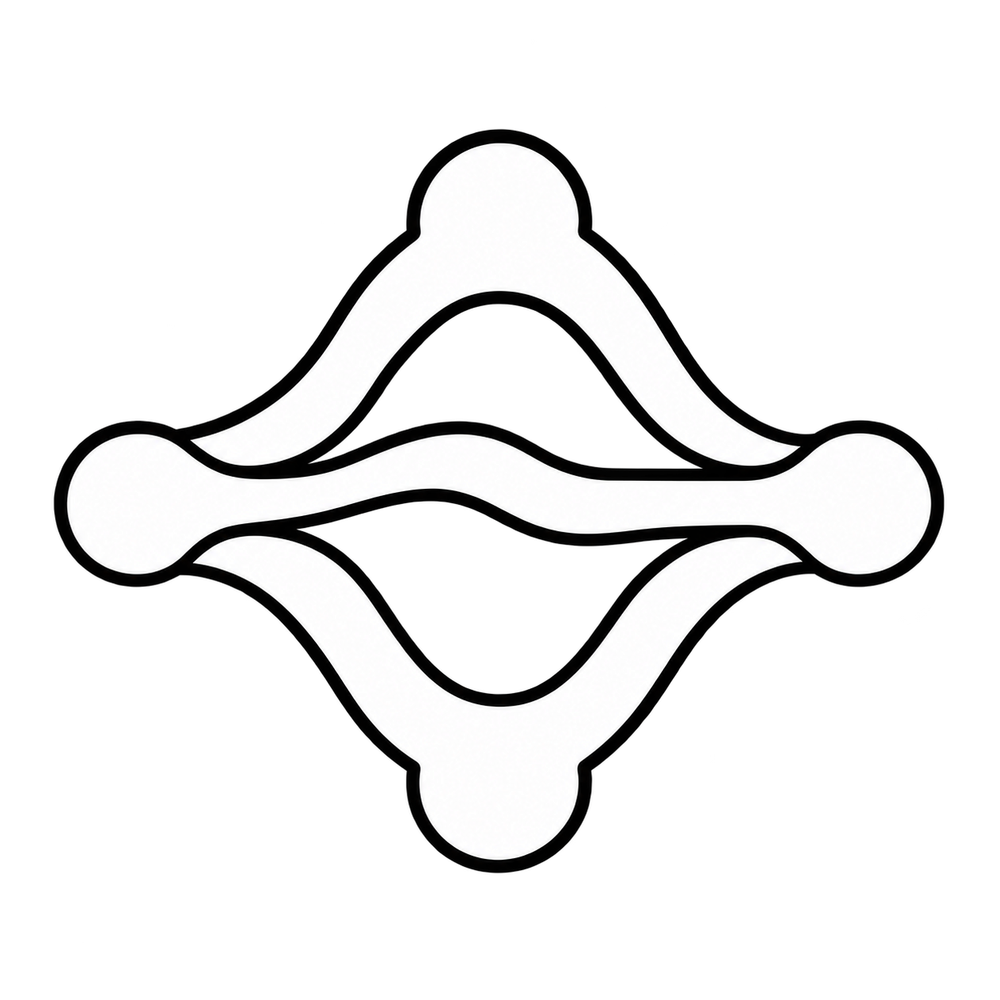
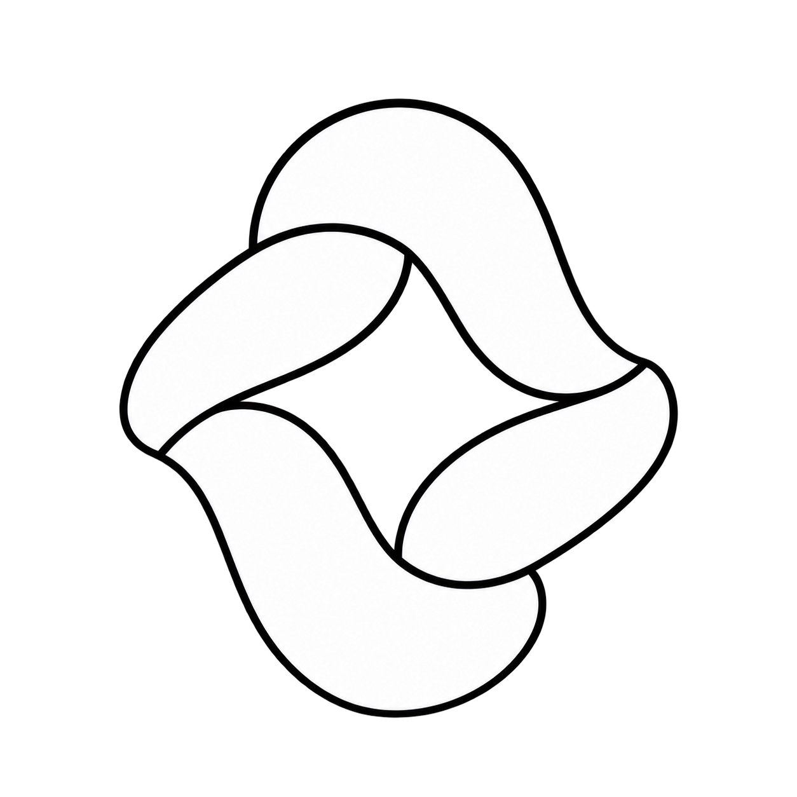
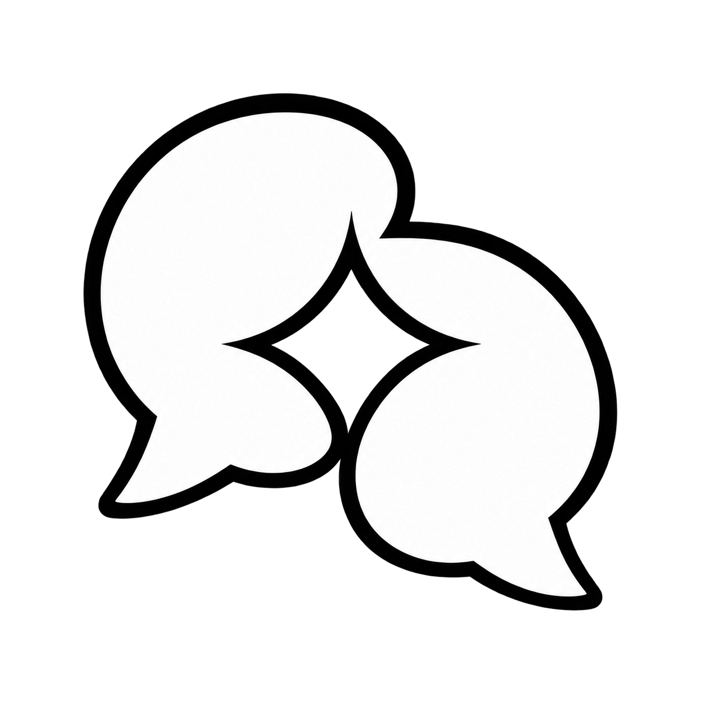

# DIR ECHOES — варианты знака

Выбран пользователем **№ 04 — птица из звуковой волны**. Белый знак с чёрным контуром, без названия, на прозрачном PNG-фоне. Рабочий файл интерфейса: `public/brand/dir-echoes-mark.png`. Остальные варианты сохранены для сравнения. Созданы встроенным ImageGen 23 сентября 2026 года. Это растровые изображения; векторный мастер пока не создан.

## Первая серия

| 01 · Эхо | 02 · Маршруты | 03 · Поток |
| --- | --- | --- |
|  |  |  |

Бриф первой серии: собственный знак DIR ECHOES без букв и монограммы, белые формы с чёрным контуром на прозрачном фоне. Три направления: открытое ядро из трёх волн; разветвление потока; две противоположные ленты вокруг открытого центра.

## Новая тематика

| 04 · Птица-голос | 05 · Диалог с искрой | 06 · Направление |
| --- | --- | --- |
|  |  |  |

Это варианты собственного бренда DIR ECHOES. Предоставленный знак Halyk используется отдельно в анимации частиц во время ожидания.

### Точные промпты новой серии

#### 04-voicebird

```text
Use case: logo-brand. Original symbol-only logo for DIR ECHOES, a multilingual voice assistant. No words, no letters, no numbers or monograms anywhere. Single centered isolated mark, generous transparent padding. Pure white filled silhouette with a crisp substantial black outline, flat vector-like graphic, visually strong at 24px. Genuinely transparent background with alpha. No gradients, gray shading, metallic finish, textures, shadows, 3D, mockup, watermark, multiple logo alternatives or decorative frame. This direction must be distinct from generic circular AI knots and swirling rings. Subject: a compact abstract bird in flight whose wing consists of just three bold stepped sound-wave feathers. Beak subtly suggests direction and listening, confident welcoming silhouette. Elegant restrained geometry, a memorable asymmetrical symbol, no realistic illustration. Only 2 or 3 clearly separated solid shapes, no tiny details.
```

#### 05-dialogue-spark

```text
Use case: logo-brand. Original symbol-only logo for DIR ECHOES, a multilingual voice assistant. No words, no letters, no numbers or monograms anywhere. Single centered isolated mark, generous transparent padding. Pure white filled silhouette with a crisp substantial black outline, flat vector-like graphic, visually strong at 24px. Genuinely transparent background with alpha. No gradients, gray shading, metallic finish, textures, shadows, 3D, mockup, watermark, multiple logo alternatives or decorative frame. This direction must be distinct from generic circular AI knots and swirling rings. Subject: two opposing rounded speech forms creating a small four-point spark in the negative space between them. Conversation and clarity, balanced warm geometric silhouette. Use only two bold compact interlocking but nonwoven shapes; avoid an infinity loop, spiral or flower. The center spark is negative space, not an extra colored object.
```

#### 06-direction

```text
Use case: logo-brand. Original symbol-only logo for DIR ECHOES, a multilingual voice assistant. No words, no letters, no numbers or monograms anywhere. Single centered isolated mark, generous transparent padding. Pure white filled silhouette with a crisp substantial black outline, flat vector-like graphic, visually strong at 24px. Genuinely transparent background with alpha. No gradients, gray shading, metallic finish, textures, shadows, 3D, mockup, watermark, multiple logo alternatives or decorative frame. This direction must be distinct from generic circular AI knots and swirling rings. Subject: a decisive upward-right direction arrow built from three compact offset voice-wave bars, a strong angular silhouette with carefully softened corners. Communicates routing a voice to the right answer. Minimal purposeful geometry with clever negative-space gaps, 3 solid white shapes maximum. Avoid app icons, ornamental borders, stars, circles, generic play button.
```
