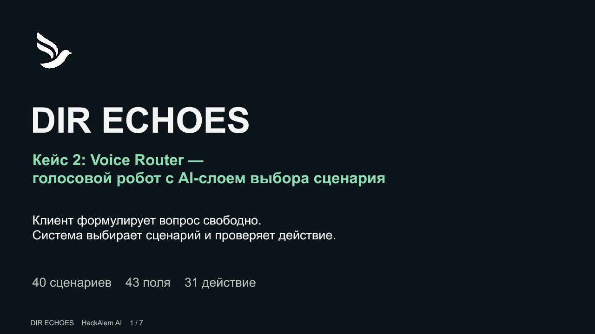

# Презентация DIR ECHOES

**Кейс 2: Voice Router — голосовой робот с AI-слоем выбора сценария.**

[Редактируемый PowerPoint](DIR-ECHOES.pptx) · [PDF для просмотра](DIR-ECHOES.pdf) · [Приложение](https://dir-echoes-voice-router.vercel.app)

Семь слайдов на русском языке для короткой защиты решения HackAlem AI. В PPTX подписи, обозначения и схема архитектуры редактируются обычными инструментами PowerPoint. Снимки интерфейса встроены как изображения; их оригиналы сохранены в [assets](../assets/README.md). PDF служит визуальной копией для просмотра.

## Содержание

1. **DIR ECHOES** — свободная формулировка клиента, сценарий и проверка действия. 40 сценариев, 43 поля и 31 действие описывают официальный каталог, а не точность модели.
2. **Клиентский разговор** — реальный экран с обозначением старта голоса, чата, подсказок и меню.
3. **Супервизор рядом с клиентом** — реальный список разговоров, подключение человека и сохранённая история.
4. **Архитектура и граница решений** — редактируемая схема: ввод, LLM, проверка, исполнитель и PostgreSQL.
5. **Контроль каждого изменения** — идентификация, согласие, устойчивый повтор и журнал.
6. **Что подтверждено и что проверить** — сборка и публикация отдельно от живого аудио, новых языков и двух устройств.
7. **Маршрут проверки для жюри** — SC01, логика маршрута, SC29, история и SC37.

Текущий release: `901e228`, Vercel Ready 23 сентября 2026 года в 17:38. Операторский снимок соответствует локальной сборке `901e228`; клиентский и мобильный снимки сохранены со сборки `9688e01`. Пользователь подтвердил операторскую связь в своём сеансе; это не проверка всех сетей. Ссылки на источники реализации и ограничения также внесены в заметки слайдов.

## Во время защиты

Используйте только вымышленные записи официального кейса. Демо-коды ролей опубликованы владельцем в главном README; API-ключи и доступ к базе остаются на сервере. Для живого оператора откройте участника и супервизора в разных браузерах или на разных устройствах.

Не объявляйте цели 500 мс / 1,5 с достигнутыми. Сборка и deployment не подтверждают слышимость. Внешние платежи, SMS и расписания остаются запросами на исполнение; операторский WebRTC без TURN зависит от сети. Подробные основания находятся в [матрице приёмки](../ACCEPTANCE.md) и [контрольных точках](../CHECKPOINTS.md).
